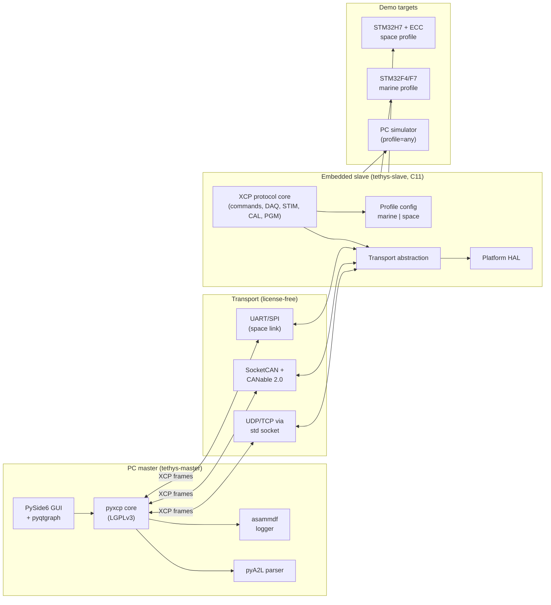

# Tethys — XCP Tool for Extreme Environments (Marine + Space)

> **Name:** *Tethys* is both a Greek sea titan (mother of the rivers and oceans) and an icy moon of Saturn — the single word that natively binds the marine and space domains the tool targets. Project codename: `tethys`. Package prefixes: `tethys-master` (Python), `tethys-slave` (C).

## 1. Reality check before we build

XCP is, by design, a **development-time** calibration and measurement protocol — not a flight/operational protocol. In production:

- **Space:** real telemetry runs over CCSDS on SpaceWire / MIL-STD-1553B / UART
- **Marine class:** runtime data runs over NMEA 2000 / J1939 / Modbus / IEC 61162

So the realistic role of an XCP tool in extreme environments is:

1. Calibrate / measure during HIL and integration testing on the ground
2. Stay quiescent in flight, optionally enable via a service-mode command for debug telemetry
3. Be the same tool the project uses for both marine and space teams (unified UX, two profiles)

The plan below treats the slave as **dual-mode**: a normal flight-time minimal path, plus an XCP debug path gated by an authenticated runtime flag.

## 2. System architecture



## 3. Component breakdown (no proprietary licenses anywhere)

### 3.1 PC master tool — `tethys-master`

Pure Python, runs on Win/Linux/macOS. Independent of Vehicle Network Toolbox.

- **Protocol:** [`pyxcp`](https://github.com/christoph2/pyxcp) (LGPLv3) — implements ASAM XCP 1.4 over Ethernet/CAN/USB/SxI
- **A2L parser:** [`Sauci/pya2l`](https://github.com/Sauci/pya2l) (BSD-3) preferred; [`christoph2/pyA2L`](https://github.com/christoph2/pyA2L) (GPLv2) as fallback
- **GUI:** PySide6 (LGPL)
- **Plots:** pyqtgraph (real-time), matplotlib (post-analysis)
- **Logging:** [`asammdf`](https://github.com/danielhrisca/asammdf) (MDF4 — industry-standard measurement format)
- **MATLAB bridge:** MDF/CSV/Parquet export + MATLAB's built-in `py.` interface to call Python directly — no Vehicle Network Toolbox required
- **Packaging:** PyInstaller single-file binaries per OS, plus pip distribution

### 3.2 Embedded slave library — `tethys-slave`

Portable C11, single repo, MISRA C:2023-compliant subset.

- **Reference base:** study [`vectorgrp/XCPlite`](https://github.com/vectorgrp/XCPlite) (MIT) for the Ethernet path; build a clean-room implementation against the public ASAM XCP 1.4 specification and AUTOSAR `AUTOSAR_SWS_XCP.pdf` so the codebase is unencumbered for any licensing choice
- **Layered design:**
  - `tethys_core/` — command dispatcher, DAQ/ODT engine, CAL page handler, CRC, seed-and-key hooks
  - `tethys_transport/` — pluggable: `tethys_can.c`, `tethys_eth.c`, `tethys_sxi.c`
  - `tethys_platform/` — `platform_stm32.c`, `platform_posix.c`, `platform_bare.c`
  - `tethys_profile.h` — compile-time flags selecting features per profile
- **No dynamic allocation** anywhere (required by both ECSS and MISRA)
- **Static analysis gates:** `cppcheck --addon=misra`, `clang-tidy`, `gcc -fanalyzer`; Frama-C/WP optional on the protocol core for properties expressed as ACSL contracts

### 3.3 Profile system

| Concern                             | Marine profile                     | Space profile                                                                          |
| ----------------------------------- | ---------------------------------- | -------------------------------------------------------------------------------------- |
| Default transports                  | CAN-FD + Ethernet (UDP)            | UART/SxI + CAN (1-wire fault-tolerant)                                                 |
| Endianness handling                 | both, runtime-detect               | both, fixed at compile time                                                            |
| Memory protection                   | optional checksum on CAL pages     | mandatory ECC/EDAC wrapper on RAM regions exposed to XCP                               |
| Watchdog interaction                | optional kick on DAQ tick          | mandatory — XCP must never block the watchdog path                                     |
| Seed and key                        | optional, 4-byte                   | mandatory, 16-byte AES-derived                                                         |
| Permitted commands in "flight" mode | read-only DAQ on a fixed whitelist | DAQ disabled by default, enabled via authenticated service-mode command                |
| A2L generation                      | dev-time                           | dev-time + signed binary hash in A2L header                                            |
| Logging                             | full MDF4                          | budgeted: ring buffer with watermark                                                   |
| Coding rules                        | MISRA C:2023 mandatory + required  | MISRA C:2023 mandatory + required + advisory; no recursion, no goto, all loops bounded |

## 4. Safety and standards mapping

A single living traceability matrix in `docs/traceability.csv` maps every module and test to the controlling standard objective. Generated into `docs/standards-trace.md` by a CI job that fails when coverage of a referenced objective drops.

- **Process layer**
  - Space (ESA): ECSS-E-ST-40C Rev.1 (April 2025) engineering, ECSS-Q-ST-80C SW product assurance, ECSS-Q-ST-60-02C ASIC/FPGA
  - Space (NASA): NPR 7150.2D, NASA-STD-8739.8 (SW assurance), NASA-HDBK-2203 (SW engineering handbook)
  - Aviation crossover: DO-178C with DAL-B target; DO-330 for tool qualification (for the master)
  - Marine class society: IACS UR E22 Rev.3 (in force from 1 Jul 2024), DNV-CG-0264, Lloyd's Register ShipRight Procedure for Software
  - Generic functional safety underpinning both: IEC 61508 (target SIL 2 default; SIL 3 design feasibility for safety-critical calibration values)
- **Coding layer**
  - MISRA C:2023 (mandatory + required as a hard CI gate; advisory tracked with rationale in `docs/misra-deviations.md`)
  - CERT C for security-sensitive parts (seed-and-key, command parser)
  - Naming, formatting, header guards, banned constructs documented in `docs/coding-standard.md`
- **Verification layer**
  - Unit tests with Ceedling/Unity; ≥100% statement, ≥95% MC/DC on the protocol core (DAL-B grade)
  - Integration tests with the PC simulator slave driven by the master
  - Fuzzing the command parser with libFuzzer + AFL++; corpora committed; growth tracked nightly
  - Robustness suite: dropped/reordered/duplicated frames, A2L drift, timeout edge cases, malformed CTO
- **Hardware/environmental layer** (documented, not necessarily executed without lab access)
  - Marine: IEC 60945 (maritime navigation equipment env), salt-spray IEC 60068-2-52, vibration IEC 60068-2-6
  - Space: ECSS-E-ST-10-03C (testing), thermal vacuum profile, TID/SEU expectations per orbit class
- **Documentation set** (one-to-one with what reviewers under any of the above standards will ask for)
  - SDP — Software Development Plan
  - SRD / SVD — software requirements + verification specification
  - SAD — software architecture description (this plan extended)
  - SVCP / STR — verification procedures + test reports
  - SCMP — software configuration management plan
  - SQAP — software quality assurance plan
  - Traceability matrix (req ↔ design ↔ code ↔ tests)

## 5. Toolchain (every item is free)

- Python 3.11+, `pyxcp`, `Sauci/pya2l`, `asammdf`, PySide6, pyqtgraph, `pytest`, `pytest-qt`, `ruff`, `mypy`
- Build: GCC, Clang, arm-none-eabi-gcc, CMake, Ninja, uv (Python package manager)
- Static analysis: `cppcheck --addon=misra`, `clang-tidy`, `gcc -fanalyzer`, `scan-build`, optional Frama-C/WP
- Coverage: `gcovr`, `lcov`, `coverage.py`
- Unit test: Unity + Ceedling (C), pytest (Python)
- Fuzzing: libFuzzer (built into Clang), AFL++
- CI: GitHub Actions free tier
- Docs: Sphinx + Breathe + Doxygen, MyST-Parser; PlantUML + Mermaid for diagrams
- SBOM + supply chain: CycloneDX, Renovate, Dependabot, `pip-audit`, `osv-scanner`
- Hardware (suggested, low-cost):
  - CAN interface: CANable 2.0 (~USD 40, SocketCAN, no Vector licence)
  - Marine target: STM32F4/F7 Nucleo or Discovery + MCP2562 CAN transceiver + W5500 Ethernet
  - Space target: STM32H7 (ECC RAM) as the academic stand-in for GR716A / RAD750 / Vorago VA416xx
  - HIL: pure-software simulator slave on the PC, any profile selectable

## 6. Development architecture and engineering process

This is what separates "I wrote a hobby project" from "I ran a real safety-critical SDLC". Every practice below is enforced either by a CI gate, a branch-protection rule, or a `.cursor/rules/*.mdc` file that flags violations during agent-assisted development.

### 6.1 Repository discipline

- Single public mono-repo on GitHub, MIT or Apache-2.0 licensed (decide in ADR-0008)
- **Conventional Commits** (`feat`, `fix`, `chore`, `docs`, `ci`, `refactor`, `test`, `perf`, `build`, `revert`) enforced by `pr-title.yml`
- **SemVer** for both `tethys-master` (PEP 440) and `tethys-slave` (CMake `project(... VERSION ...)`)
- **CHANGELOG.md** generated by semantic-release on every tag
- **Trunk-based development:** short-lived feature branches off `main`, squash-merged via PR; release branches only at v1.0 onward
- **Tag = release:** tags `v0.x.y` trigger `release.yml` which builds artefacts and attaches them with a CycloneDX SBOM
- **Branch protection:** required reviews, required status checks (build, MISRA, static-analysis, coverage, fuzz-smoke, secret-scan, dependency-review, a2l-roundtrip), linear history, signed commits

### 6.2 PR workflow

Every change lands via PR, even from the project owner. Workflow:

1. Open issue (or pick from board)
2. Open PR draft → CI runs on every push
3. Self-review against the rule mirror in `.github/instructions/`
4. Request GitHub Copilot review (free for public repos)
5. Address comments → mark "Ready for review"
6. Squash-merge with the conventional-commit title

PR template enforces a checklist: tests added, MISRA clean, coverage delta, docs updated, ADR added if architectural, traceability matrix updated if requirement-touching.

### 6.3 ADRs (MADR v3.0)

`docs/adr/0001-...md` onward, immutable once accepted. Status: `proposed` → `accepted` → `superseded by ADR-NNNN`. Stub set committed in PR-3:

| ADR | Subject |
| --- | --- |
| 0001 | XCP as a development-time protocol (not flight bus) |
| 0002 | Profile-based build system (marine, space) |
| 0003 | MISRA C:2023 as the coding gate |
| 0004 | Transport-abstraction layer with frozen interface |
| 0005 | No dynamic allocation anywhere in the slave |
| 0006 | AES-128-derived seed-and-key for space profile |
| 0007 | Python master tool, MATLAB is consumer not driver |
| 0008 | License-free toolchain; license choice for the repo |

### 6.4 Research notes (one per phase)

`docs/research/phase-<N>-<topic>.md`. Required sections: scope, retrieval-dated source list (≤14 days old at PR time), decisions log, open questions, citations into the relevant ADR. The `research-note-per-phase.mdc` Cursor rule flags any phase PR that lacks one.

### 6.5 Cursor rules and AGENTS.md mirror

`.cursor/rules/*.mdc` is the single source of project conventions for any AI agent (Cursor, Copilot, Claude). Mirrored verbatim into `.github/instructions/` so GitHub Copilot Workspace and code-review bot pick up the same rules. Top-level `AGENTS.md`, `CLAUDE.md`, and `.github/copilot-instructions.md` are short stubs that point at the rule directory.

Tethys-specific rules (committed in PR-2):

- `xcp-protocol-discipline.mdc` — every protocol commit cites the ASAM XCP 1.4 spec section
- `misra-c-2023-gate.mdc` — no merge with open mandatory/required deviations
- `ecss-traceability.mdc` — every new requirement gets a row in `docs/traceability.csv`
- `marine-profile-invariants.mdc` and `space-profile-invariants.mdc` — feature constraints per profile
- `no-dynamic-allocation.mdc` — `malloc`/`calloc`/`realloc`/`free` banned in slave; CI greps for them
- `no-recursion-no-goto.mdc` — space profile only; cppcheck rule + manual review
- `always-cite-standards.mdc` — PRs that touch traced code must include the standard citation in the commit body
- `research-note-per-phase.mdc` — see §6.4
- `version-pinning.mdc` — every dependency pinned exactly; Renovate proposes upgrades via PR
- `free-tool-only.mdc` — no PR may introduce a paid-license-required dependency
- `conventional-commits.mdc` — title format, scope list, body format

### 6.6 GitHub project management

- **Repo:** public, branch-protected, signed commits
- **Milestones:** Phase 0 through Phase 11 (12 milestones, one per phase)
- **Labels** (52 total, mirroring the lotusgift discipline):
  - `type/*`: feat, fix, chore, docs, ci, refactor, test, perf, build, revert
  - `phase/*`: phase-0 .. phase-11
  - `prio/*`: p0, p1, p2, p3
  - `area/*`: master, slave, transport, profile-marine, profile-space, docs, ci, standards
  - `special`: epic, phase-acceptance, research-note, security, blocked, good-first-issue, help-wanted, standards-deviation
- **Projects v2 board** "Tethys Roadmap" with four custom fields: `Phase`, `Workstream` (Master / Slave / Profile / Standards / Docs / CI), `Layer` (Protocol / Transport / Platform / GUI / Tests / Docs), `Type` (Feature / Bug / Chore / Research / Standards-trace). Auto-add workflow attaches every new issue/PR
- **Issue types per phase:** one Research-Note issue, one Epic issue, one Phase-Acceptance issue, plus N feature issues
- **PR-Issue linking:** every PR references an issue with `Closes #NN`; phase-acceptance issue closes when every child closes plus the demo recording is attached

### 6.7 CI/CD gate matrix

| Workflow | Trigger | Gate semantics |
| --- | --- | --- |
| `ci.yml` | every push, every PR | build + unit + integration tests; matrix: ubuntu/windows/macos × master, ubuntu × posix-sim, arm-none-eabi × stm32-{f4,f7,h7} |
| `misra-gate.yml` | every PR touching `slave/` | zero open MISRA mandatory/required deviations; advisory deviations require entry in `docs/misra-deviations.md` |
| `static-analysis.yml` | every PR | clang-tidy + gcc -fanalyzer + scan-build; zero new warnings |
| `coverage.yml` | every PR + nightly | ≥95% statement, ≥90% MC/DC on `tethys_core/`; trend chart published |
| `fuzz-nightly.yml` | nightly cron | libFuzzer over the command-parser corpus; new crashes open issues automatically |
| `a2l-roundtrip.yml` | every PR touching A2L | parse-emit-parse round-trip equivalence; drift = failure |
| `pr-title.yml` | every PR | Conventional Commits |
| `secret-scan.yml` | every push | TruffleHog / gitleaks |
| `dependency-review.yml` | every PR | GitHub Dependency Review API |
| `sbom.yml` | every tag | CycloneDX SBOM attached to the GitHub Release |
| `release.yml` | tag `v*` | build PyInstaller bundles, slave tarballs, Docker image; create Release with SBOM |

CI total budget target: < 12 minutes wall-clock on the free tier per PR.

### 6.8 Sub-plan and status-sync workflow (per todo)

Adopted verbatim from the lotusgift discipline. Every Phase-0 through Phase-11 todo follows this loop:

1. **Draft sub-plan** for the todo via `CreatePlan` → a new `.cursor/plans/<todo-id>_*.plan.md`. Sub-plan includes: research summary with retrieval-dated URLs, file-by-file deliverables, acceptance criteria, open questions, status-sync closing step.
2. **Deep research** — fetch the latest official docs (≤14 days old) for every dependency touched, including the relevant standard section. Bake citations into `docs/research/phase-<N>-<topic>.md`.
3. **User review** of the sub-plan; refinements happen by direct edits.
4. **Execute** in agent mode, CLI-only for scaffolding (uv, cmake init, ceedling new, gh).
5. **Status sync** at end of implementation:
   - Update parent plan todo status: `pending → in_progress → completed`
   - Update GitHub Projects v2 item Status field: `Todo → In progress → In review → Done`
   - Comment on the linked Issue with the PR URL, then close with `state_reason: completed`
   - Link the PR into the research note as "Implementation Reference"
6. **Loop back** to plan mode for the next todo.

No step is skipped. Every PR has a sub-plan, a research note, and a status sync — even one-file changes.

## 7. Phase 0 deliverables (PR-by-PR)

Phase 0 is the foundation that all later phases rely on. Eight PRs (numbered to mirror the lotusgift pattern):

- **PR-1 `chore(scaffold)`** — monorepo bootstrap, CLI-only. `uv init master/`, `cmake -S slave -B slave/build -P scripts/scaffold-cmake.cmake`, `ceedling new slave/tests`, `uv init simulator/`, `git mv` any pre-existing files into `_old/` if needed.
- **PR-2 `chore(rules)`** — full `.cursor/rules/*.mdc` set + `.github/instructions/` mirror + `AGENTS.md` + `CLAUDE.md` + `.github/copilot-instructions.md`.
- **PR-3 `docs(architecture)`** — README rewrite, `docs/architecture/system-context.md`, `docs/architecture/dep-graph.svg`, ADR-0001..ADR-0008 in MADR v3.0.
- **PR-4 `ci`** — all 11 workflows from §6.7 + issue/PR templates + CODEOWNERS + branch-protection.json.
- **PR-5 `chore(quality)`** — `.clang-format`, `.clang-tidy`, `.editorconfig`, `cppcheck.cfg` with MISRA addon, `.gitattributes`, pre-commit config, `docs/coding-standard.md`.
- **PR-6 `docs(runbook)`** — `docs/runbooks/{release-process, hardware-setup-stm32, hil-bench-setup, traceability-matrix-maintenance, incident-and-defect, supply-chain-and-sbom, demo-recording}.md` + index README.
- **PR-0a `docs(runbook)`** — `docs/runbooks/github-setup.md` (PAT scopes, visibility, Projects v2 bootstrap, milestones, labels, branch protection). This PR is opened first; lettered to mark its pre-requisite status.
- **Parallel via `gh` CLI + GitHub MCP** — 12 milestones, 52 labels, Phase-0 Research-Note + Epic + Phase-Acceptance issues, CODEOWNERS, branch-protection.json applied.

After Phase 0: pause for review, then proceed to Phase 1 with the sub-plan/research/status-sync loop.

## 8. Phased implementation (P1..P11)

Each phase is one Epic Issue, several feature PRs, one Phase-Acceptance Issue closed only when the phase demo is recorded.

- **Phase 1 — Shared infrastructure (weeks 2–3)**
  Master `pyproject.toml` (uv-pinned), structlog + pydantic-settings + click CLI. Slave CMake foundation with warnings-as-errors, MISRA preset, sanitisers in CI. Unity+Ceedling baseline. A2L fixture corpus. Posix-sim entry point. Acceptance: CONNECT/DISCONNECT exchange over UDP loopback.

- **Phase 2 — XCP protocol core (weeks 4–5)**
  Command dispatcher (CONNECT, DISCONNECT, GET_VERSION, GET_STATUS, SYNCH, SET_MTA, UPLOAD, SHORT_UPLOAD, DOWNLOAD, BUILD_CHECKSUM). CTO/DTO framing. Time-stamping. A2L MEASUREMENT/CHARACTERISTIC parsing on the master. Acceptance: ≥95% MC/DC on dispatcher; differential test against pyxcp reference.

- **Phase 3 — DAQ + STIM (week 6)**
  ODT engine, DAQ list config, event channel binding, optional PTP timestamping, STIM path. asammdf MDF4 logger + pyqtgraph plots in master. Acceptance: 1 kHz DAQ on simulator, zero loss for 60 minutes; MDF4 opens in Vector's free viewer.

- **Phase 4 — CAL + PAG (week 7)**
  Online calibration write, CAL page switching, CRC validation, A2L-driven limit-checks in master, persistent CAL via flash mirror. Acceptance: round-trip calibrate-restart-verify; CRC mismatch blocks commit.

- **Phase 5 — Transport pluggability (week 8)**
  Freeze TransportPort interface. Implement UDP/TCP, SocketCAN via CANable 2.0, UART/SxI. One conformance suite reused across all transports. Acceptance: same DAQ test passes on all three.

- **Phase 6 — Master GUI (week 9)**
  PySide6 app — connection wizard, A2L tree, pyqtgraph plots, calibration editor with limit-checks, profile selector, MDF4 record/playback, diagnostics pane. Acceptance: keyboard-only nav passes; headless smoke test via pytest-qt.

- **Phase 7 — Marine profile on STM32F4/F7 (weeks 10–11)**
  BSP, FreeRTOS, CAN-FD + Ethernet (W5500), `marine.cmake`, demo workload (synthetic engine signals at 1 kHz DAQ). Acceptance: 24h soak, zero leaks, watchdog never tripped; IEC 60945 + IACS UR E22 Rev.3 trace rows filled.

- **Phase 8 — Space profile on STM32H7 (weeks 12–13)**
  EDAC wrap on CAL pages, watchdog kick in DAQ tick, AES-128 seed-and-key, authenticated service-mode unlock, deterministic ODT scheduling, fault-injection bench. Acceptance: MC/DC ≥95% on protocol core; fault-injection catalogue documented; ECSS-E-ST-40C + NPR 7150.2D + DO-178C DAL-B trace rows filled.

- **Phase 9 — HIL + MATLAB (week 14)**
  Closed-loop bench: master tool drives the STM32 slave, Simulink (academic licence, no Vehicle Network Toolbox) drives the plant. Two demos: marine common-rail injector control + diagnostic DAQ; satellite reaction-wheel torque calibration + housekeeping DAQ. Each recorded end-to-end.

- **Phase 10 — Verification pack (week 15)**
  Generated traceability matrix, fuzz corpora, robustness suite, coverage report, MISRA report. All published as a downloadable PDF bundle on the docs site.

- **Phase 11 — v1.0 release + portfolio (week 16)**
  PyInstaller bundles, slave tarballs, Docker image, pip release, GitHub Release with CycloneDX SBOM, Sphinx + GitHub Pages docs site, two demo videos, one-page case-study PDF.

## 9. Tooling parity — open-source equivalents to commercial chain

Demonstrating literacy with the commercial chain (what every JD lists) while showing a license-free path is built and works.

| Commercial tool | Used for | Tethys equivalent | Parity status |
| --- | --- | --- | --- |
| Vector CANape / ETAS INCA | XCP master, A2L editing, calibration GUI | `tethys-master` (PySide6 + pyxcp + pya2l) | core flows: connect, A2L browse, DAQ, calibration, MDF4 record |
| Vector CANalyzer / CANoe | CAN bus tracing, simulation | SocketCAN + Wireshark CAN dissector + cantools | tracing + decoding parity; CANoe simulation not in scope |
| MATLAB Vehicle Network Toolbox | XCP from MATLAB / Simulink | MATLAB `py.` interface to `tethys-master` + MDF export | parity for measurement / calibration scripted use |
| Polyspace Bug Finder / Code Prover | Static + abstract-interp analysis | cppcheck-misra + clang-tidy + gcc -fanalyzer + scan-build + (optional) Frama-C/WP | rule coverage parity for MISRA; absolute coverage gap declared in ADR |
| LDRA Testbed / LDRA TBvision | MISRA, MC/DC, traceability | cppcheck-misra + gcovr MC/DC + Sphinx-generated traceability | MISRA + MC/DC parity; full LDRA tool-qualification artefacts out of scope |
| Green Hills MULTI / IAR Safety | Qualified compiler | GCC + clang with `-Werror -pedantic -fanalyzer`; qualification gap noted | tool-qualification gap declared; real flight code would need a qualified compiler |
| ETAS RTA-OS / Vector MICROSAR | AUTOSAR Classic Platform | not in scope; XCP module spec implemented as a reference reading | n/a |
| Doors / Polarion | Requirements management | Sphinx-needs or sdoc + `docs/traceability.csv` + GitHub Issues with `phase/*` labels | small-team parity; enterprise scale gaps declared |

Every gap is explicitly named in ADRs so reviewers can see the project owner understands the difference.

## 10. What you explicitly cannot do without paid tools (and the workaround)

- **No ETAS INCA / Vector CANape** — `tethys-master` replaces them for the core measurement/calibration flow. Lost: certified A2L UI, OEM-specific extensions, vendor support. Workaround: hand-edit A2L (text), validate with pya2l's checker.
- **No Vehicle Network Toolbox** — confirmed not in standard MATLAB academic Campus license. Workaround: drive XCP from Python; MATLAB's `py.` interface calls Python with zero extra licence.
- **No certified MISRA checker (LDRA, Polyspace)** — Polyspace ships with some academic site licences; if available, run it in addition. Otherwise `cppcheck --addon=misra` covers the public MISRA C:2023 rule set; deviations documented.
- **No qualified compiler (Green Hills, IAR Safety)** — GCC/Clang with `-Wall -Wextra -Werror -pedantic -fanalyzer` plus clang-tidy is acceptable for academic and demonstrator work; ADR-0008 records the gap for any future certifiable production path.

## 11. Public deliverables (what someone reading the repo will see)

- Public GitHub repo with branch protection, signed commits, CI badges (build / coverage / MISRA / fuzz / standards)
- Sphinx + GitHub Pages docs site under `https://<owner>.github.io/tethys` with:
  - README + system-context diagram
  - ADR index (0001..0008)
  - Runbooks index
  - Traceability matrix browser
  - Doxygen-generated slave API reference
  - Phase-by-phase research notes
- GitHub Releases with: PyInstaller bundles per OS, slave library tarball, Docker image, CycloneDX SBOM, signed checksums
- Two demo videos (marine + space) embedded in README and docs site
- `docs/case-study.pdf` — one-page summary: scope, standards, metrics, screenshots
- GitHub Projects v2 board (read-only public link) showing phase progression
- Closed Issues + merged PRs tell the engineering story chronologically

## 12. Standards compliance scorecard

Live scorecard auto-generated by CI, embedded in README:

| Dimension | Target | Phase | Source of truth |
| --- | --- | --- | --- |
| MISRA C:2023 mandatory + required | 0 deviations | P0 onward | `misra-gate.yml` artefact |
| MISRA C:2023 advisory | documented | P0 onward | `docs/misra-deviations.md` |
| Statement coverage on protocol core | ≥95% | P2 onward | gcovr badge |
| MC/DC coverage on protocol core | ≥90% (≥95% by P8) | P2 onward | gcovr badge |
| Fuzz corpus size (command parser) | growing | P2 onward | nightly artefact |
| Static-analysis warnings (clang-tidy + scan-build) | 0 new | P0 onward | `static-analysis.yml` |
| Secret scan | clean | P0 onward | `secret-scan.yml` |
| SBOM completeness | 100% deps | every tag | `sbom.yml` artefact |
| ECSS-E-ST-40C objective coverage | tracked, ≥70% by P11 | P0 onward | `docs/traceability.csv` |
| NPR 7150.2D objective coverage | tracked, ≥70% by P11 | P0 onward | `docs/traceability.csv` |
| IACS UR E22 Rev.3 objective coverage | tracked, ≥70% by P11 | P0 onward | `docs/traceability.csv` |
| DO-178C DAL-B objective coverage (informational) | tracked | P0 onward | `docs/traceability.csv` |

The scorecard is the headline of the README. A reviewer can answer "is this a serious project" in 30 seconds.

## 13. Open questions (parked for the relevant phase research note)

- **P3/P5/P8 — RESOLVED in PR-0c**: Packet-loss tolerance budget per (profile × transport × direction × XCP service). Resolved by [ADR-0010 draft](docs/adr/drafts/adr-0010-packet-loss-tolerance-budget.md) (proposed in PR-0c, formalised by PR-3). Full derivation + standards anchoring in [`docs/research/phase-0-system-requirements.md`](docs/research/phase-0-system-requirements.md) §6. SIL 2 lower-band residual envelope (≤ 1e-9/h), per-transport rows for UDP / TCP / CAN-FD / SocketCAN / UART-SxI-with-COP-1 / 1-wire FT CAN / loopback.
- **P2/P8**: Seed-and-key scheme final choice — `none`, custom 4-byte, or AES-128 derived. Plan currently assumes AES-128 for space profile, 4-byte optional for marine.
- **P4**: XCP PGM (flash programming) support — in scope or out? PGM roughly doubles slave footprint and adds a bootloader spec. Plan currently parks it as out-of-scope; reconsider at P10.
- **P7/P8**: Hardware procurement — STM32 Nucleo boards (~$25–40 each) are baseline; if access to a GR716A / RAD750 evaluation kit is possible the space profile gains significant credibility.
- **P0-issues**: GitHub Issues vs Linear — Linear MCP is available in this workspace. Recommend GitHub Issues for public visibility (matches portfolio goal); Linear for private workstream tracking if desired.
- **P0**: Repository license — MIT for maximum compatibility, or Apache-2.0 for explicit patent grant. Decision in ADR-0008.

## 14. Repository layout

```
tethys/
  master/                          # Python PC master  (package: tethys-master)
    pyproject.toml                 # uv-managed
    src/tethys_master/
      gui/  protocol/  profiles/  logging/  cli/
    tests/
    docs/                          # local docstrings; Sphinx pulls from here
  slave/                           # Embedded C library (package: tethys-slave)
    CMakeLists.txt
    cmake/                         # toolchain files; warning preset; sanitiser preset
    include/tethys/
    src/
      core/  transport/  platform/
    profiles/
      marine.cmake
      space.cmake
    tests/                         # Unity + Ceedling
    fuzz/                          # libFuzzer corpora and harnesses
  simulator/                       # PC-hosted slave for CI (tethys-sim)
  hil/                             # HIL harness + MATLAB/Simulink models
  docs/
    architecture/
      system-context.md
      dep-graph.svg
    adr/
      0001-xcp-as-development-protocol.md
      0002-profile-based-build-system.md
      ...0008-license-choice.md
    research/                      # phase-N-topic.md, retrieval-dated
    runbooks/
      README.md                    # index
      github-setup.md
      release-process.md
      hardware-setup-stm32.md
      hil-bench-setup.md
      traceability-matrix-maintenance.md
      incident-and-defect.md
      supply-chain-and-sbom.md
      demo-recording.md
    standards-trace.md             # generated from docs/traceability.csv
    traceability.csv               # canonical source
    misra-deviations.md
    coding-standard.md
    sdp.md  sad.md  svcp.md  scmp.md  sqap.md
    case-study.pdf                 # delivered at P11
  .cursor/
    rules/                         # *.mdc — single source of dev conventions
    plans/                         # this file + sub-plans + research notes
  .github/
    workflows/                     # ci, misra-gate, static-analysis, coverage,
                                   # fuzz-nightly, a2l-roundtrip, pr-title,
                                   # secret-scan, dependency-review, sbom, release
    instructions/                  # mirror of .cursor/rules/
    ISSUE_TEMPLATE/
      epic.md  phase-acceptance.md  feature.md  bug.md  research-note.md  standards-deviation.md
    PULL_REQUEST_TEMPLATE.md
    CODEOWNERS
    copilot-instructions.md
    dependabot.yml
    renovate.json
  AGENTS.md                        # short stub pointing at .cursor/rules/
  CLAUDE.md                        # short stub pointing at .cursor/rules/
  CHANGELOG.md                     # semantic-release generated
  README.md                        # badges + 60-second elevator pitch + scorecard
  LICENSE                          # MIT or Apache-2.0 per ADR-0008
  CONTRIBUTING.md
  SECURITY.md
  CODE_OF_CONDUCT.md
  infrastructure/
    docker/                        # Dockerfile + compose for CI use of the simulator
    github/
      branch-protection.json
```
