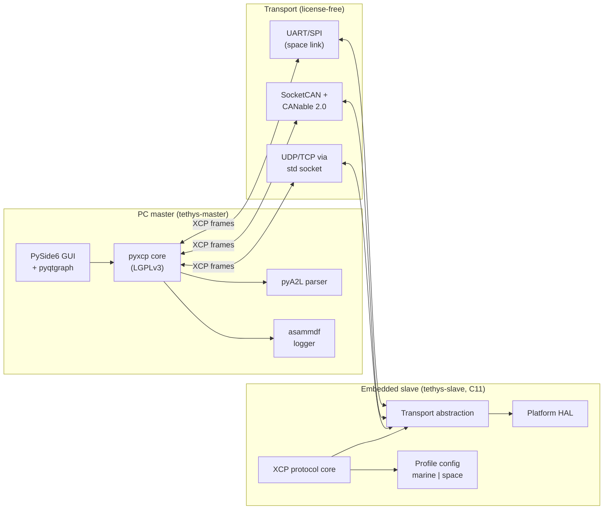

# Tethys — XCP for extreme environments (marine + space)

> *Tethys* is both a Greek sea titan (mother of the rivers and oceans) and an icy moon of Saturn — the single word that natively binds the marine and space domains this tool targets.

[](https://github.com/goldr0g3r/tethys/actions/workflows/ci.yml)
[](https://github.com/goldr0g3r/tethys/actions/workflows/coverage.yml)
[](https://github.com/goldr0g3r/tethys/actions/workflows/misra-gate.yml)
[](https://github.com/goldr0g3r/tethys/actions/workflows/fuzz-nightly.yml)
[](https://github.com/goldr0g3r/tethys/actions/workflows/a2l-roundtrip.yml)
[](LICENSE)

> Badge URLs assume the PR-4 (`p0-ci`) workflows. Until PR-4 lands they render as broken images on purpose - they advertise the PR-4 gap and force its completion.

## 60-second pitch

Tethys is a portfolio-grade, **license-free**, two-part XCP system:

- A Python PC master (CANape / INCA replacement) for online calibration + measurement
- A portable C11 embedded slave library, configurable via marine + space profiles

Built with a PR-driven, ADR-backed, research-note-per-phase development workflow patterned on serious safety-critical engineering practice, and mapped against ECSS-E-ST-40C Rev.1, NPR 7150.2D, IACS UR E22 Rev.3, IEC 61508, ISO 26262:2018, MISRA C:2023, and DO-178C.

## Standards-compliance scorecard

Live scorecard (auto-generated by CI once PR-4 ships; current values are the design targets):

| Dimension | Target | Phase | Source of truth |
| --- | --- | --- | --- |
| MISRA C:2023 mandatory + required | 0 deviations | P0 onward | `misra-gate.yml` artefact |
| MISRA C:2023 advisory | documented | P0 onward | `docs/misra-deviations.md` |
| Statement coverage on protocol core | >=95% | P2 onward | gcovr badge |
| MC/DC coverage on protocol core | >=90% (>=95% by P8) | P2 onward | gcovr badge |
| Fuzz corpus size (command parser) | growing | P2 onward | nightly artefact |
| Static-analysis warnings (clang-tidy + scan-build) | 0 new | P0 onward | `static-analysis.yml` |
| Secret scan | clean | P0 onward | `secret-scan.yml` |
| SBOM completeness | 100% deps | every tag | `sbom.yml` artefact |
| ECSS-E-ST-40C objective coverage | tracked, >=70% by P11 | P0 onward | `docs/traceability.csv` |
| NPR 7150.2D objective coverage | tracked, >=70% by P11 | P0 onward | `docs/traceability.csv` |
| IACS UR E22 Rev.3 objective coverage | tracked, >=70% by P11 | P0 onward | `docs/traceability.csv` |
| DO-178C DAL-B objective coverage (informational) | tracked | P0 onward | `docs/traceability.csv` |

## System architecture



See [`docs/architecture/system-context.md`](docs/architecture/system-context.md) for the full architecture description and [`docs/architecture/dep-graph.mmd`](docs/architecture/dep-graph.mmd) (renders inline on GitHub) for the dependency + standards graph. SVG export lands in PR-4 (CI runs `mmdc` in a clean container).

## Quick start

Tethys is in Phase 0 (foundation). The functional code lands in Phase 1+. Today you can:

```bash
# Clone
git clone https://github.com/goldr0g3r/tethys.git
cd tethys

# Master (Python; uv-managed)
cd master && uv sync

# Simulator
cd ../simulator && uv sync

# Slave (CMake + Ninja; needs cmake-init or PR-1a Ceedling for tests)
cd ../slave
cmake --preset=dev   # configures dev build
cmake --build --preset=dev
```

The CLI entry points (`uv run tethys-master ...` etc.) land in Phase 1 per the parent plan.

## Architecture Decision Records (ADRs)

Tethys uses [MADR v3.0](https://adr.github.io/madr/). See [`docs/adr/README.md`](docs/adr/README.md) for the full index. Currently:

- [ADR-0001](docs/adr/0001-xcp-as-development-protocol.md) - XCP as a development-time protocol
- [ADR-0002](docs/adr/0002-profile-based-build-system.md) - Profile-based build system
- [ADR-0003](docs/adr/0003-misra-c-2023-as-coding-gate.md) - MISRA C:2023 as the coding gate
- [ADR-0004](docs/adr/0004-transport-abstraction-layer.md) - Transport-abstraction-layer interface
- [ADR-0005](docs/adr/0005-no-dynamic-allocation.md) - No dynamic allocation in the slave
- [ADR-0006](docs/adr/0006-aes-128-seed-and-key.md) - AES-128 derived seed-and-key (space profile)
- [ADR-0007](docs/adr/0007-python-master-not-matlab.md) - Python master tool, MATLAB is consumer not driver
- [ADR-0008](docs/adr/0008-license-free-toolchain.md) - License-free toolchain + repo license
- [ADR-0009](docs/adr/0009-rulesets-migration.md) - Migrate `main` to a Repository Ruleset *(proposed)*
- [ADR-0010](docs/adr/0010-packet-loss-tolerance-budget.md) - Packet-loss tolerance budget

## Runbooks

Step-by-step recipes any engineer can execute. See [`docs/runbooks/README.md`](docs/runbooks/README.md) for the full index. Currently:

- [`github-setup.md`](docs/runbooks/github-setup.md) - bootstrap the GitHub surface (labels, milestones, branch protection, Projects v2 board, bootstrap issues)
- Remaining runbooks (release-process, hardware-setup-stm32, hil-bench-setup, traceability-matrix-maintenance, incident-and-defect, supply-chain-and-sbom, demo-recording) land in PR-6.

## Research notes

The per-phase evidence trail under [`docs/research/`](docs/research/). Currently:

- [`phase-0-github-setup.md`](docs/research/phase-0-github-setup.md) - PR-0a research note (GitHub setup decisions)
- [`phase-0-system-requirements.md`](docs/research/phase-0-system-requirements.md) - PR-0c research note (12-section multi-standard analysis, packet-loss budget anchor)
- [`phase-0-standards-matrix.csv`](docs/research/phase-0-standards-matrix.csv) + [`phase-0-standards-matrix.md`](docs/research/phase-0-standards-matrix.md) - 35-row standards landscape
- [`phase-0-issues-execution.md`](docs/research/phase-0-issues-execution.md) - PR-4 (`p0-issues`) execution record
- [`phase-1-scaffold-execution.md`](docs/research/phase-1-scaffold-execution.md) - PR-5 (`p0-scaffold`) execution record
- [`phase-0-rules-execution.md`](docs/research/phase-0-rules-execution.md) - PR-7 (`p0-rules`) execution record
- [`phase-0-docs-execution.md`](docs/research/phase-0-docs-execution.md) - this PR's execution record

## Phase progress

| Phase | Status | PRs |
| --- | --- | --- |
| Phase 0 - Foundation | in progress | PR-0a, PR-0c, #4 (`p0-issues`), #5 (`p0-scaffold`), #7 (`p0-rules`), this PR (`p0-docs`) |
| Phase 0 remaining | pending | `p0-ci`, `p0-coding-standards`, `p0-runbooks` |
| Phase 1 - Shared infrastructure | pending | `p1` |
| Phase 2 - XCP protocol core | pending | `p2` |
| Phase 3 - DAQ + STIM | pending | `p3` |
| Phase 4 - CAL + PAG | pending | `p4` |
| Phase 5 - Transport pluggability | pending | `p5` |
| Phase 6 - Master GUI | pending | `p6` |
| Phase 7 - Marine profile on STM32F4/F7 | pending | `p7` |
| Phase 8 - Space profile on STM32H7 | pending | `p8` |
| Phase 9 - HIL + MATLAB | pending | `p9` |
| Phase 10 - Verification pack | pending | `p10` |
| Phase 11 - v1.0 release + portfolio | pending | `p11` |

Full plan: [`.cursor/plans/xcp_extreme-env_tool_14019278.plan.md`](.cursor/plans/xcp_extreme-env_tool_14019278.plan.md).

## Contributing

See [`AGENTS.md`](AGENTS.md) (the same content is mirrored in [`CLAUDE.md`](CLAUDE.md) and [`.github/copilot-instructions.md`](.github/copilot-instructions.md) for each agent's expected entry point). Canonical project conventions live in [`.cursor/rules/`](.cursor/rules/) (12 rule files).

## License

[MIT](LICENSE). Toolchain license posture: [ADR-0008](docs/adr/0008-license-free-toolchain.md).
