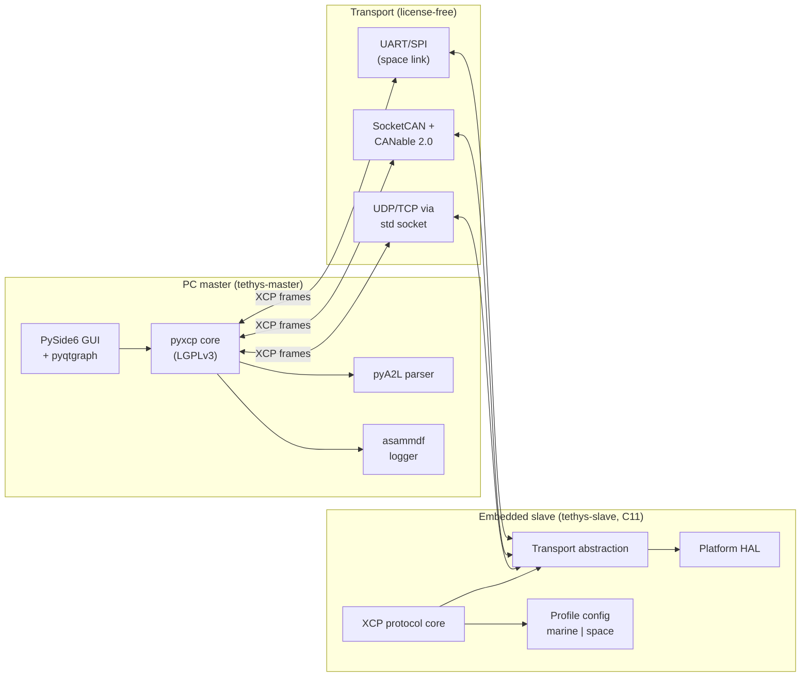

# Tethys — XCP for extreme environments (marine + space)

> *Tethys* is both a Greek sea titan (mother of the rivers and oceans) and an icy moon of Saturn — the single word that natively binds the marine and space domains this tool targets.

[](https://github.com/goldr0g3r/tethys/actions/workflows/ci.yml)
[](https://github.com/goldr0g3r/tethys/actions/workflows/coverage.yml)
[](https://github.com/goldr0g3r/tethys/actions/workflows/misra-gate.yml)
[](https://github.com/goldr0g3r/tethys/actions/workflows/fuzz-nightly.yml)
[](https://github.com/goldr0g3r/tethys/actions/workflows/a2l-roundtrip.yml)
[](https://github.com/goldr0g3r/tethys/actions/workflows/docs-site.yml)
[](LICENSE)

> **Docs site:** [goldr0g3r.github.io/tethys](https://goldr0g3r.github.io/tethys/) — the full `docs/` tree (architecture, ADRs, runbooks, learn, research notes, traceability) rendered by Sphinx + GitHub Pages, auto-deployed on every push to `main` via `docs-site.yml` (Phase 11 PR-A). One-time project-owner enablement: Settings → Pages → "GitHub Actions".

> Badges live since PR #11 (p0-ci) + PR #19 (F5 workflow rename to canonical contexts). Branch protection now requires 7 status checks: `build`, `misra-gate`, `static-analysis`, `coverage`, `secret-scan`, `dependency-review`, `pr-title`.

## 60-second pitch

Tethys is a portfolio-grade, **license-free**, two-part XCP system:

- A Python PC master (CANape / INCA replacement) for online calibration + measurement
- A portable C11 embedded slave library, configurable via marine + space profiles

Built with a PR-driven, ADR-backed, research-note-per-phase development workflow patterned on serious safety-critical engineering practice, and mapped against ECSS-E-ST-40C Rev.1, NPR 7150.2D, IACS UR E22 Rev.3, IEC 61508, ISO 26262:2018, MISRA C:2023, and DO-178C.

## Standards-compliance scorecard

Live scorecard (auto-generated by CI once PR-4 ships; current values are the design targets):

| Dimension | Target | Phase | Source of truth |
| --- | --- | --- | --- |
| MISRA C:2023 mandatory + required | 0 deviations | P0 onward | `misra-gate.yml` artefact |
| MISRA C:2023 advisory | documented | P0 onward | `docs/misra-deviations.md` |
| Statement coverage on protocol core | >=95% | P2 onward | gcovr badge |
| MC/DC coverage on protocol core | >=90% (>=95% by P8) | P2 onward | gcovr badge |
| Fuzz corpus size (command parser) | growing | P2 onward | nightly artefact |
| Static-analysis warnings (clang-tidy + scan-build) | 0 new | P0 onward | `static-analysis.yml` |
| Secret scan | clean | P0 onward | `secret-scan.yml` |
| SBOM completeness | 100% deps | every tag | `sbom.yml` artefact |
| ECSS-E-ST-40C objective coverage | tracked, >=70% by P11 | P0 onward | `docs/traceability.csv` |
| NPR 7150.2D objective coverage | tracked, >=70% by P11 | P0 onward | `docs/traceability.csv` |
| IACS UR E22 Rev.3 objective coverage | tracked, >=70% by P11 | P0 onward | `docs/traceability.csv` |
| DO-178C DAL-B objective coverage (informational) | tracked | P0 onward | `docs/traceability.csv` |

## System architecture



See [`docs/architecture/system-context.md`](docs/architecture/system-context.md) for the full architecture description and [`docs/architecture/dep-graph.mmd`](docs/architecture/dep-graph.mmd) (renders inline on GitHub) for the dependency + standards graph. SVG export lands in PR-4 (CI runs `mmdc` in a clean container).

## Quick start

Phase 1 ships the hello-world XCP CONNECT/DISCONNECT acceptance bench. From a clean clone:

```bash
git clone https://github.com/goldr0g3r/tethys.git
cd tethys

# Terminal 1 - posix-sim slave
cd simulator && uv sync
uv run tethys-sim serve --transport udp --port 5555

# Terminal 2 - master CLI
cd master && uv sync
uv run tethys-master connect --target udp://127.0.0.1:5555
```

Expected output (under 1 ms wall-clock on UDP loopback):

```text
CONNECT OK
  resource = 0x05
  comm     = 0x80
  max_cto  = 8
  max_dto  = 256
  protocol = 0x01, transport = 0x01
  version  = protocol 1.4, transport 1.4
  status   = session 0x80, protect 0x00
DISCONNECT OK
```

For the C slave library + Unity tests:

```bash
# Slave library build (cmake-init derived)
cd slave
cmake --preset=dev
cmake --build --preset=dev

# Unity + Ceedling tests (requires Ruby 3.3 + ceedling gem)
cd tests
ceedling test:all   # 18 tests pass
```

Test totals after Phase 1: **49 tests passing** (23 master + 8 simulator + 18 slave).

## Learn

Long-form explainers that build from "I've never heard of this" to "I can read the ADRs and understand the trade-offs". See [`docs/learn/README.md`](docs/learn/README.md) for the full index. Currently:

- [`xcp-101.md`](docs/learn/xcp-101.md) - XCP from first principles for an engineer who has never seen it before; master/slave, A2L, CTO/DTO, DAQ/ODT, CAL/PAG, STIM, transports, seed-and-key, loss handling, full session walk-through, glossary.

## Architecture Decision Records (ADRs)

Tethys uses [MADR v3.0](https://adr.github.io/madr/). See [`docs/adr/README.md`](docs/adr/README.md) for the full index. Currently:

- [ADR-0001](docs/adr/0001-xcp-as-development-protocol.md) - XCP as a development-time protocol
- [ADR-0002](docs/adr/0002-profile-based-build-system.md) - Profile-based build system
- [ADR-0003](docs/adr/0003-misra-c-2023-as-coding-gate.md) - MISRA C:2023 as the coding gate
- [ADR-0004](docs/adr/0004-transport-abstraction-layer.md) - Transport-abstraction-layer interface
- [ADR-0005](docs/adr/0005-no-dynamic-allocation.md) - No dynamic allocation in the slave
- [ADR-0006](docs/adr/0006-aes-128-seed-and-key.md) - AES-128 derived seed-and-key (space profile)
- [ADR-0007](docs/adr/0007-python-master-not-matlab.md) - Python master tool, MATLAB is consumer not driver
- [ADR-0008](docs/adr/0008-license-free-toolchain.md) - License-free toolchain + repo license
- [ADR-0009](docs/adr/0009-rulesets-migration.md) - Migrate `main` to a Repository Ruleset *(proposed)*
- [ADR-0010](docs/adr/0010-packet-loss-tolerance-budget.md) - Packet-loss tolerance budget

## Runbooks

Step-by-step recipes any engineer can execute. See [`docs/runbooks/README.md`](docs/runbooks/README.md) for the full index. 8 runbooks shipped:

- [`github-setup.md`](docs/runbooks/github-setup.md) - PR-0a: PAT, repo, branch protection, CODEOWNERS, Projects v2, milestones, labels, auto-add workflow, Phase-0 issues.
- [`release-process.md`](docs/runbooks/release-process.md) - PR-6: tag `v0.x.y` -> `release.yml` -> PyInstaller bundles + slave tarball + Docker image + CycloneDX SBOM + GitHub Release + PyPI.
- [`hardware-setup-stm32.md`](docs/runbooks/hardware-setup-stm32.md) - PR-6: NUCLEO-F767ZI marine + NUCLEO-H753ZI space wiring, flashing, transport setup.
- [`hil-bench-setup.md`](docs/runbooks/hil-bench-setup.md) - PR-6: closed-loop master + slave + Simulink plant model via MATLAB `py.` interface.
- [`traceability-matrix-maintenance.md`](docs/runbooks/traceability-matrix-maintenance.md) - PR-6: csv schema, add-row, CI gate behaviour.
- [`incident-and-defect.md`](docs/runbooks/incident-and-defect.md) - PR-6: severity matrix, MISRA deviation lifecycle, security incident handling, PIR template.
- [`supply-chain-and-sbom.md`](docs/runbooks/supply-chain-and-sbom.md) - PR-6: CycloneDX SBOM, Renovate/Dependabot, 90-day PAT rotation, CVE triage, license audit.
- [`demo-recording.md`](docs/runbooks/demo-recording.md) - PR-6: OBS Studio + DaVinci Resolve + shot lists for both demos.

## Docs site

The complete `docs/` tree is rendered as a public Sphinx + GitHub Pages site at <https://goldr0g3r.github.io/tethys/> (Phase 11 / PR-A; deploys on every push to `main` via [`docs-site.yml`](.github/workflows/docs-site.yml)). One-time project-owner enablement: Settings → Pages → "GitHub Actions".

The site sections mirror this README: architecture, ADRs, runbooks, learn, research notes, traceability, coding standard, MISRA deviations. Build locally with:

```bash
python -m venv .venv-docs && . .venv-docs/bin/activate
pip install -r docs/site/requirements.txt
sphinx-build -W --keep-going -c docs/site -b html docs docs/_build/html
# Output at docs/_build/html/site/index.html
```

## Research notes

Per-phase evidence trail under [`docs/research/`](docs/research/) (research-note-per-phase rule). 11 notes shipped:

- [`phase-0-github-setup.md`](docs/research/phase-0-github-setup.md) - PR-0a (GitHub setup decisions)
- [`phase-0-system-requirements.md`](docs/research/phase-0-system-requirements.md) - PR-0c (12-section multi-standard analysis, packet-loss budget anchor)
- [`phase-0-standards-matrix.csv`](docs/research/phase-0-standards-matrix.csv) + [`phase-0-standards-matrix.md`](docs/research/phase-0-standards-matrix.md) - 35-row standards landscape
- [`phase-0-issues-execution.md`](docs/research/phase-0-issues-execution.md) - PR #4 (`p0-issues`)
- [`phase-1-scaffold-execution.md`](docs/research/phase-1-scaffold-execution.md) - PR #5 (`p0-scaffold`)
- [`phase-0-rules-execution.md`](docs/research/phase-0-rules-execution.md) - PR #7 (`p0-rules`)
- [`phase-0-docs-execution.md`](docs/research/phase-0-docs-execution.md) - PR #9 (`p0-docs`)
- [`phase-0-ci-execution.md`](docs/research/phase-0-ci-execution.md) - PR #11 (`p0-ci`)
- [`phase-0-coding-standards-execution.md`](docs/research/phase-0-coding-standards-execution.md) - PR #15 (`p0-coding-standards`)
- [`phase-0-runbooks-execution.md`](docs/research/phase-0-runbooks-execution.md) - PR #16 (`p0-runbooks`)
- [`phase-0-scaffold-tests-execution.md`](docs/research/phase-0-scaffold-tests-execution.md) - PR #17 (`p0-scaffold-tests`)
- [`phase-0-layout-execution.md`](docs/research/phase-0-layout-execution.md) - PR #18 (`p0-layout`)
- [`phase-0-ci-fixes-f5-execution.md`](docs/research/phase-0-ci-fixes-f5-execution.md) - PR #19 + #21 (F5 workflow rename + branch protection re-tighten)
- [`phase-1-shared-infrastructure-execution.md`](docs/research/phase-1-shared-infrastructure-execution.md) - PR #22 (Phase 1 hello-world XCP)

## Phase progress

| Phase | Status | Key PR(s) |
| --- | --- | --- |
| **Phase 0** - Foundation | **completed** | #4 (issues), #5 (scaffold), #7 (rules), #9 (docs/ADRs), #11 (CI), #15 (coding-standards), #16 (runbooks), #17 (scaffold-tests), #18 (layout), #19 + #21 (F5 workflow rename + branch protection) |
| **Phase 1** - Shared infrastructure | **completed** | #22 (master + simulator + slave XCP CONNECT/DISCONNECT/GET_VERSION/GET_STATUS over UDP loopback, 49 tests green, <1ms round-trip) |
| Phase 2 - XCP protocol core | pending | `p2` |
| Phase 3 - DAQ + STIM | pending | `p3` |
| Phase 4 - CAL + PAG | pending | `p4` |
| Phase 5 - Transport pluggability | pending | `p5` |
| Phase 6 - Master GUI | pending | `p6` |
| Phase 7 - Marine profile on STM32F4/F7 | pending | `p7` |
| Phase 8 - Space profile on STM32H7 | pending | `p8` |
| Phase 9 - HIL + MATLAB | pending | `p9` |
| Phase 10 - Verification pack | pending | `p10` |
| Phase 11 - v1.0 release + portfolio | pending | `p11` |

Full plan: [`.cursor/plans/xcp_extreme-env_tool_14019278.plan.md`](.cursor/plans/xcp_extreme-env_tool_14019278.plan.md).

## Contributing

See [`AGENTS.md`](AGENTS.md) (the same content is mirrored in [`CLAUDE.md`](CLAUDE.md) and [`.github/copilot-instructions.md`](.github/copilot-instructions.md) for each agent's expected entry point). Canonical project conventions live in [`.cursor/rules/`](.cursor/rules/) (12 rule files).

## License

[MIT](LICENSE). Toolchain license posture: [ADR-0008](docs/adr/0008-license-free-toolchain.md).
