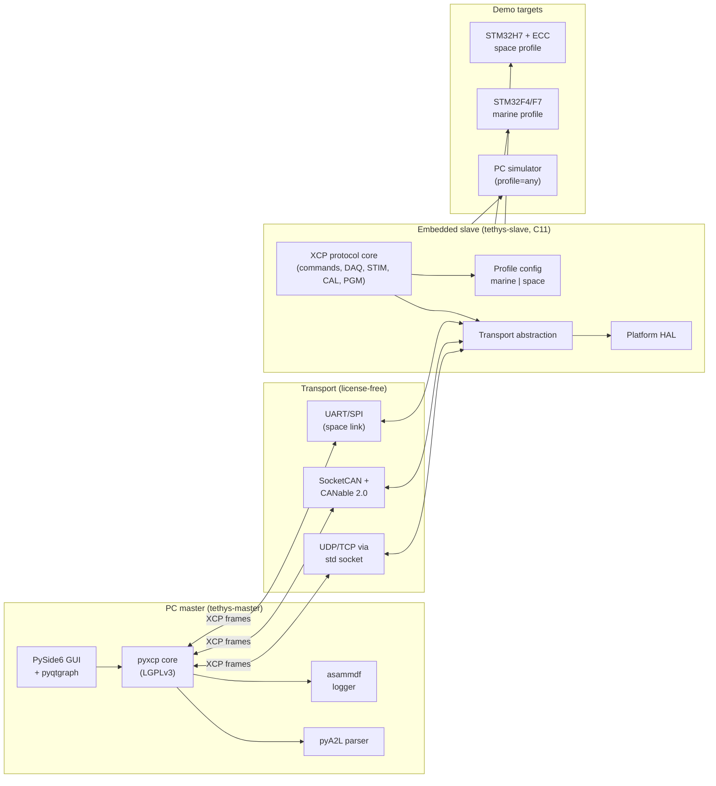
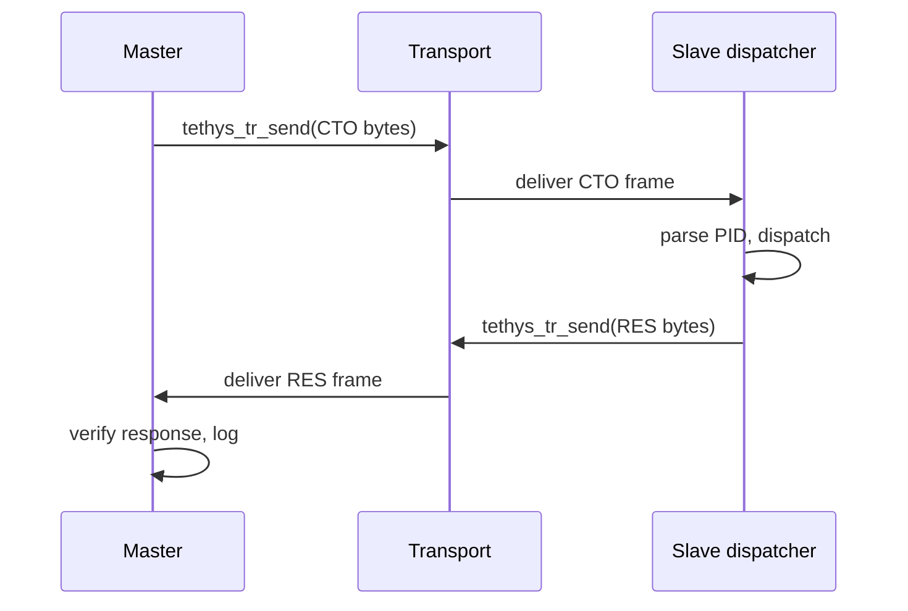

# System context — Tethys

> Expansion of parent plan §2 (system architecture). This document is the architectural reference; each cited [ADR](../adr/) records a specific decision.

## 1. Overview

Tethys is a two-part XCP system: a Python master tool that runs on a PC and a portable C11 embedded slave library that runs on microcontrollers (or, during development, on the same PC via a posix-sim). One source tree, two compile-time profiles ([ADR-0002](../adr/0002-profile-based-build-system.md)): **marine** and **space**.



## 2. PC master architecture

The master (`tethys-master`) is pure Python and runs on Windows / Linux / macOS. Decision rationale: [ADR-0007](../adr/0007-python-master-not-matlab.md).

| Concern | Component | Source |
| --- | --- | --- |
| XCP protocol | [pyxcp](https://github.com/christoph2/pyxcp) (LGPLv3) | upstream |
| A2L parser | [Sauci/pya2l](https://github.com/Sauci/pya2l) (BSD-3) preferred / [christoph2/pyA2L](https://github.com/christoph2/pyA2L) (GPLv2) fallback | upstream |
| GUI | PySide6 (LGPL) | upstream |
| Real-time plots | pyqtgraph | upstream |
| Post-analysis plots | matplotlib | upstream |
| Measurement logger | [asammdf](https://github.com/danielhrisca/asammdf) (MDF4) | upstream |
| MATLAB bridge | MATLAB built-in `py.` interface | matlab |
| Packaging | PyInstaller (per-OS binaries) + pip | own |

The master is also the place where the [`phase-0-system-requirements.md` §7](../research/phase-0-system-requirements.md#7-daq-recovery-semantics) `DAQ_GAP` event is constructed and logged into MDF4.

## 3. Transport layer

Tethys supports five transports across both profiles. The interface is fixed by [ADR-0004](../adr/0004-transport-abstraction-layer.md) and freezes at Phase 5.

| Transport | Profile | XCP service support | Loss-budget row |
| --- | --- | --- | --- |
| UDP (IEC 61162-450) | Marine | CTO + DAQ + CAL | [ADR-0010](../adr/0010-packet-loss-tolerance-budget.md) rows 1-3 |
| TCP | Marine | CTO + CAL writes | row 4 |
| CAN-FD | Marine | CTO + DAQ | rows 5-6 |
| SocketCAN (host) | Marine (dev) | any | row 7 |
| UART/SxI + COP-1 AD | Space | CTO + CAL + STIM | row 8 |
| TM (CCSDS 132.0-B-3) | Space | DAQ | row 9 |
| CAN (1-wire FT) | Space | CTO + DAQ | rows 10-11 |
| Loopback (posix-sim) | any | any | row 12 |

Each transport declares its capabilities through the metadata API in [ADR-0004](../adr/0004-transport-abstraction-layer.md); the protocol layer reads these at CONNECT time and applies the correct loss-tolerance policy.

## 4. Embedded slave architecture

`tethys-slave` is portable C11, MISRA C:2023 conformant per [ADR-0003](../adr/0003-misra-c-2023-as-coding-gate.md), and partitioned into three layers (parent §3.2):

```text
slave/
├── include/tethys/        # public headers consumed by master tools + tests
├── src/
│   ├── core/              # tethys_core: dispatcher + DAQ + STIM + CAL + CRC + seed-and-key hooks
│   ├── transport/         # tethys_transport: per-transport implementations (UDP, CAN-FD, UART/SxI, ...)
│   └── platform/          # tethys_platform: per-target HAL (STM32, posix-sim, bare-metal)
├── profiles/
│   ├── marine.cmake       # marine build flags + per-profile sources
│   └── space.cmake        # space build flags + per-profile sources
├── tests/                 # Unity + Ceedling (PR-1a forthcoming)
└── fuzz/                  # libFuzzer corpora and harnesses (Phase 10)
```

No dynamic allocation anywhere ([ADR-0005](../adr/0005-no-dynamic-allocation.md)). All buffers statically sized from the [ADR-0010](../adr/0010-packet-loss-tolerance-budget.md) packet-loss budget rows.

## 5. Profile system

Two compile-time profiles ([ADR-0002](../adr/0002-profile-based-build-system.md)):

| Concern | Marine | Space |
| --- | --- | --- |
| Default transports | CAN-FD + Ethernet (UDP) | UART/SxI + CAN (1-wire FT) |
| Endianness | runtime-detect | compile-time fixed |
| CAL page integrity | optional CRC | mandatory EDAC (SEC-DED Hamming) |
| Watchdog | optional kick on DAQ tick | mandatory kick on DAQ tick |
| Seed-and-key | optional 4-byte | mandatory 16-byte AES-128 ([ADR-0006](../adr/0006-aes-128-seed-and-key.md)) |
| Flight-mode | read-only DAQ on whitelist | DAQ off; service-mode-only |
| Logging | full MDF4 | budgeted ring buffer with watermark |
| MISRA rules | mandatory + required | mandatory + required + advisory; no recursion; no goto |
| Coding rules enforcement | [`marine-profile-invariants.mdc`](../../.cursor/rules/marine-profile-invariants.mdc) | [`space-profile-invariants.mdc`](../../.cursor/rules/space-profile-invariants.mdc) |

Selected via `cmake -DTETHYS_PROFILE=marine|space`. No runtime profile flag.

## 6. Demo target matrix

| Target | Hardware | Profile | Phase |
| --- | --- | --- | --- |
| posix-sim | host PC | either | 1, 3, 5, 10 |
| STM32F4/F7 Nucleo | ~USD 25-40 | marine | 7 |
| STM32H7 (ECC RAM) | ~USD 30-40 | space | 8 |
| HIL bench | + CANable 2.0 + W5500 + Simulink plant | both | 9 |

Hardware setup runbooks land in PR-6 (`docs/runbooks/hardware-setup-stm32.md`, `docs/runbooks/hil-bench-setup.md`).

## 7. Data flow

Two principal data flows: command/response (CTO) and measurement/stimulation (DTO).

### 7.1 CTO round trip



Retry on timeout (cap 3); after 3 retries, declare connection lost per [ADR-0010](../adr/0010-packet-loss-tolerance-budget.md) row 1.

### 7.2 DAQ stream

```mermaid
sequenceDiagram
    participant S as Slave event source
    participant ODT as ODT engine
    participant T as Transport
    participant M as Master
    S->>ODT: event fires (e.g. 1 kHz tick)
    ODT->>ODT: copy MEASUREMENTs into DTO
    ODT->>T: tethys_tr_send(DTO bytes)
    T->>M: deliver DTO frame
    M->>M: check CTR; if gap, emit DAQ_GAP event
    M->>M: append to MDF4
```

No retransmission for DAQ. Master compensates via per-ODT policy: `none` / `interpolate` / `hold-last` / `halt` ([`phase-0-system-requirements.md` §7.2](../research/phase-0-system-requirements.md#72-per-odt-gap-policy)).

## 8. ADR cross-references

Each architectural concern maps to one or more ADRs:

| Concern | ADRs |
| --- | --- |
| Protocol scope (dev-time vs flight) | [0001](../adr/0001-xcp-as-development-protocol.md) |
| Profile mechanism | [0002](../adr/0002-profile-based-build-system.md) |
| Coding standard | [0003](../adr/0003-misra-c-2023-as-coding-gate.md) |
| Transport interface | [0004](../adr/0004-transport-abstraction-layer.md) |
| Memory model | [0005](../adr/0005-no-dynamic-allocation.md) |
| Authentication (space) | [0006](../adr/0006-aes-128-seed-and-key.md) |
| Master tool stack | [0007](../adr/0007-python-master-not-matlab.md) |
| Toolchain + licensing | [0008](../adr/0008-license-free-toolchain.md) |
| Branch protection mechanism | [0009 proposed](../adr/0009-rulesets-migration.md) |
| Packet-loss budget | [0010](../adr/0010-packet-loss-tolerance-budget.md) |

For a complete dependency / standards graph see [`dep-graph.mmd`](dep-graph.mmd) (Mermaid; renders inline on GitHub). SVG export lands in PR-4 once CI can run `mmdc` in a clean container - the Windows npx install of `@mermaid-js/mermaid-cli` is blocked by an antivirus lock on this machine.

## References

- Parent plan §2 (system architecture); §3 (component breakdown); §16 (repo layout); §11 (public deliverables).
- [`docs/research/phase-0-system-requirements.md`](../research/phase-0-system-requirements.md) - the full multi-standard requirements analysis.
- [`docs/research/phase-0-standards-matrix.csv`](../research/phase-0-standards-matrix.csv) - 35-row standards landscape.
- [`docs/research/phase-0-rules-execution.md`](../research/phase-0-rules-execution.md) - mapping of architectural decisions to Cursor rules.
