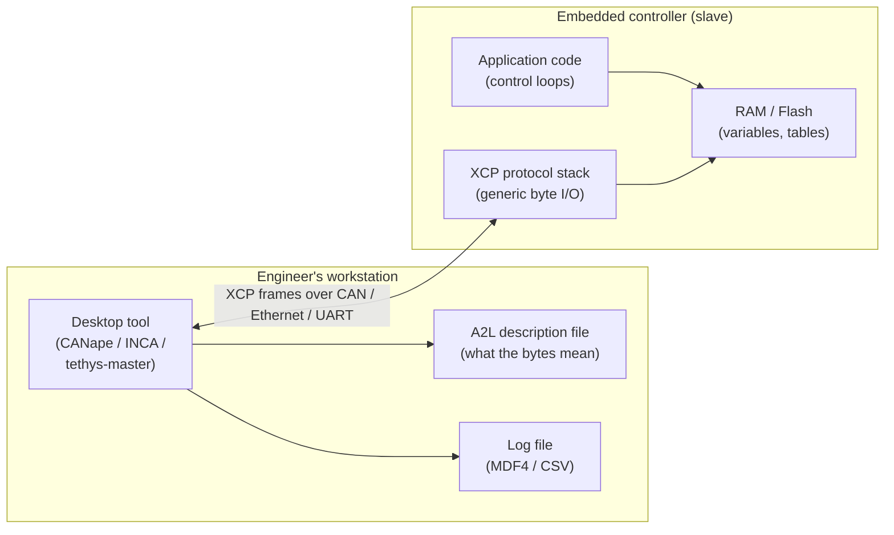
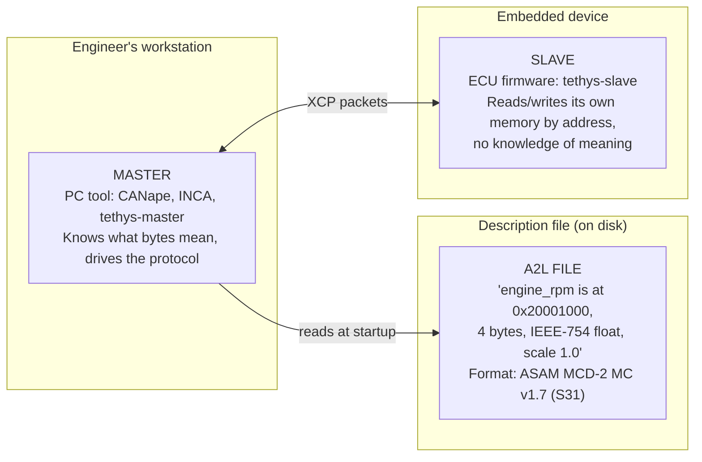
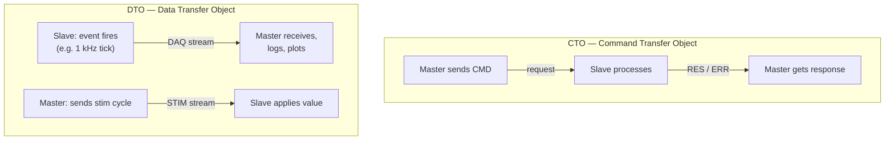
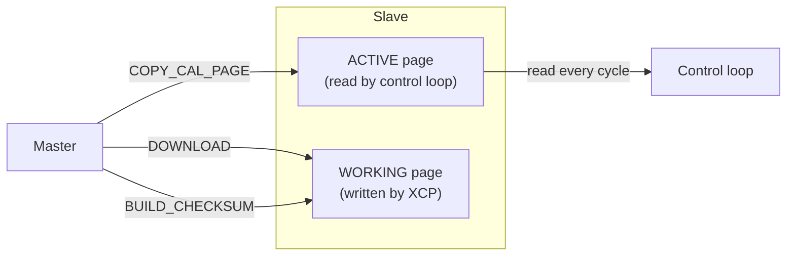
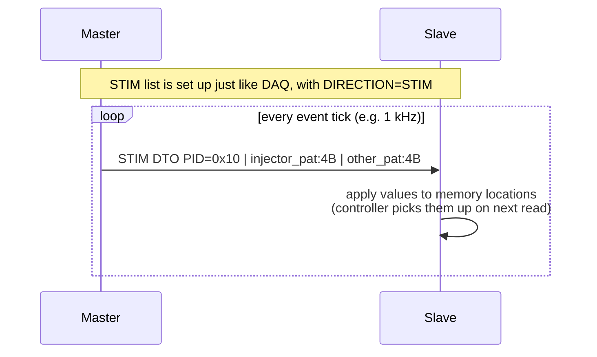
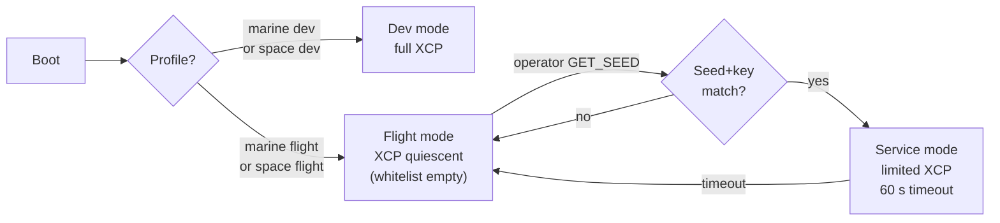

# XCP 101 — a beginner's guide to the protocol behind Tethys

> **Audience:** an engineer who has never seen XCP before. You know some C, some Python, and the basics of embedded systems and networking. You do *not* yet know what XCP, A2L, DAQ, ODT, or seed-and-key mean. By the end of this document you will.
>
> **Scope:** the protocol itself — its history, packet format, services (CTO/DTO, DAQ/STIM, CAL/PAG), transports, A2L description file, security, and where it fits in a real safety-critical system. Tethys-specific design choices are noted inline and cross-referenced to the relevant ADRs.
>
> **Length:** ~10,000 words. Read it linearly the first time; come back to §4, §6, §10, §12, and §18 as reference material.

## Table of contents

1. [What problem does XCP solve?](#1-what-problem-does-xcp-solve)
2. [The XCP story — where it came from](#2-the-xcp-story--where-it-came-from)
3. [The core idea — master, slave, and the A2L contract](#3-the-core-idea--master-slave-and-the-a2l-contract)
4. [The wire format — XCP packets at the byte level](#4-the-wire-format--xcp-packets-at-the-byte-level)
5. [CTO vs DTO — two transaction styles](#5-cto-vs-dto--two-transaction-styles)
6. [DAQ — how measurements actually flow](#6-daq--how-measurements-actually-flow)
7. [CAL + PAG — online calibration](#7-cal--pag--online-calibration)
8. [STIM — like DAQ in reverse](#8-stim--like-daq-in-reverse)
9. [Transports — how XCP rides on different buses](#9-transports--how-xcp-rides-on-different-buses)
10. [A2L — the description-file format](#10-a2l--the-description-file-format)
11. [Seed-and-key — authenticated access](#11-seed-and-key--authenticated-access)
12. [Error handling and packet loss](#12-error-handling-and-packet-loss)
13. [A typical XCP session — start to finish](#13-a-typical-xcp-session--start-to-finish)
14. [Where XCP fits in a real safety-critical system](#14-where-xcp-fits-in-a-real-safety-critical-system)
15. [XCP vs commercial tools](#15-xcp-vs-commercial-tools)
16. [How Tethys uses XCP — a quick map](#16-how-tethys-uses-xcp--a-quick-map)
17. [Further reading](#17-further-reading)
18. [Glossary](#18-glossary)

---

## 1. What problem does XCP solve?

Picture two scenes.

**Scene 1 — the engine dyno.** You're tuning a fuel-injection map on a prototype engine. The map is a 16×16 table of fuel-injection durations indexed by engine RPM (rows) and manifold pressure (columns). The table lives inside the engine controller — a small embedded computer bolted to the engine block — and the controller looks it up every 5 ms. You twist a knob; the engine misfires. You want to know:

- What did `engine_rpm` and `manifold_pressure` actually read at the moment of misfire? (*measurement*)
- Can I bump the injector duration in cell `[7, 11]` of the table by 0.3 ms without recompiling and re-flashing? (*calibration*)
- And can I do all of this **while the engine is running**, recording everything to a log file, so I can graph and analyse it afterwards?

**Scene 2 — the satellite integration lab.** A cleanroom-clean engineering model of a small satellite sits on a stand. Its attitude-control loop is running on an STM32H7 microcontroller with ECC RAM, executing what will eventually fly in orbit. The avionics engineer has just changed the gain of a reaction-wheel torque controller and wants to know:

- What torque command is the controller actually emitting at 1 kHz, signal by signal? (*measurement*)
- Can I tweak the controller gain, hot, without rebooting the whole flight stack? (*calibration*)
- And can I do this over a single UART cable that I'll later replace with a CCSDS uplink during ground operations?

Both scenes share the same underlying problem: a real-time embedded controller has *internal state* — variables, parameters, lookup tables — that the engineer needs to **read at high rates** and **write atomically** while the controller is running. The naïve alternatives are all bad:

| Naïve alternative | Why it doesn't work |
| --- | --- |
| Recompile and reflash on every change | Minutes per cycle; loses runtime state; impossible mid-run. |
| Add `printf` to a debug UART | Single signal at a time; clobbers timing; not graphical; not synchronous. |
| Use a JTAG debugger to read RAM | Halts the CPU; breaks real-time loops; cable-bound; one variable at a time. |
| Build a one-off custom protocol per ECU | Every team reinvents the wheel; no tool reuse; no description-file standard. |

What you actually want is a *standardised* protocol where the controller exposes a small generic interface — "give me byte 0x20001000, 4 bytes long" — and a desktop tool, plus a machine-readable description of what the bytes mean, does the human-friendly part.

That is exactly what XCP does. **XCP** stands for *Universal Measurement and Calibration Protocol*. The "X" means *eXchangeable transport layer* — the same protocol runs over CAN, CAN-FD, Ethernet, USB, UART/SPI, and FlexRay. XCP is published by [ASAM e.V.](https://www.asam.net/standards/detail/mcd-1-xcp/) (Association for Standardization of Automation and Measuring Systems), the same industry consortium that publishes the A2L description-file format (more on that in §3 and §10).

### Some terms before we go further

- **ECU** — *Electronic Control Unit*. An embedded computer that runs a single control loop. Engine ECU, transmission ECU, battery-management ECU, flight ECU, attitude-control ECU. In aviation people often say *LRU* (Line-Replaceable Unit); in space they say *OBC* (On-Board Computer). Throughout this document "ECU" and "slave" are used interchangeably — both refer to the embedded device that XCP talks *to*.
- **Calibration** — adjusting the *parameters* (constants, lookup tables, gains) of an embedded controller, ideally while it is running. Pre-XCP, calibration meant editing C source, recompiling, reflashing, and rebooting. With XCP it means writing a new value into the right memory location.
- **Measurement** — recording the value of *internal* variables of a running controller, ideally at a high cyclic rate (e.g. every 1 ms), with timestamps, into a log file you can graph afterwards.
- **Stimulation** — the inverse of measurement: the desktop tool writes new values into specific writable variables every cycle, while the controller is running, so that you can drive the controller from an external test pattern (more on this in §8).

In one line: **XCP lets a PC talk to an embedded controller's memory at runtime — read variables fast, write parameters atomically — through a standardised protocol that runs on top of whatever bus you have.**



The picture is straightforward. The clever part is in what's *inside* the XCP frames and how the A2L file turns "byte 0x20001000, length 4, little-endian, IEEE-754 float, scale 1.0, unit rpm" into a graphable signal called `engine_rpm`. The rest of this guide explains those two things in detail.

---

## 2. The XCP story — where it came from

XCP did not appear from nowhere. It has a clear lineage, and understanding that lineage explains a lot of its design choices.

### CCP — the CAN Calibration Protocol (1992)

In 1992, a German engineer named **Helmut Kleinknecht** at a calibration-tools company released **CCP 1.0** — the *CAN Calibration Protocol* ([CSS Electronics — CCP/XCP intro](https://www.csselectronics.com/pages/ccp-xcp-on-can-bus-calibration-protocol), retrieved 2026-05-15). It was the first widely-adopted standardised way for a PC tool to read and write the internal memory of an automotive ECU over the CAN bus, which had just become ubiquitous in cars in the late 1980s.

A working group called **ASAP** (*Arbeitskreis zur Standardisierung von Applikationssystemen*) was formed by Audi, BMW, VW, and other German OEMs to standardise CCP. ASAP later renamed itself to **ASAM** (*Association for Standardization of Automation and Measuring Systems*) and remains the keeper of XCP today.

CCP timeline (S1 — ASAM, S3 — Vector XCP Book V1.5, [CSS Electronics CCP/XCP intro](https://www.csselectronics.com/pages/ccp-xcp-on-can-bus-calibration-protocol), retrieved 2026-05-15):

- **1992** — CCP 1.0 (Helmut Kleinknecht)
- **1995** — CCP 1.01 standardised by ASAP
- **1996** — CCP 2.0
- **1999** — CCP 2.1 (the version most legacy ECUs still ship with)

CCP did its job, but had one big limitation: it was bolted to the **CAN bus**. By the late 1990s automotive networks were diversifying — LIN, FlexRay, Ethernet, MOST — and the industry wanted a calibration protocol that wasn't tied to one wire format.

### XCP — the *eX*tended *CCP* (2003)

In 2003, ASAM standardised **XCP 1.0**. The "X" replaced the "C": instead of *CAN Calibration Protocol*, it was now *Universal Measurement and Calibration Protocol*, with the explicit promise that the *protocol* would be decoupled from the *transport*. The original SAE technical paper introducing XCP put it this way:

> "The Universal Measurement and Calibration Protocol Family or XCP specification has expanded the limits of the original CAN Calibration Protocol or CCP, removing the restriction to CAN as the only transport media."
> — SAE 2003-01-1205, *Introduction to the Universal Measurement and Calibration Protocol XCP* ([SAE Mobilus link](https://saemobilus.sae.org/papers/introduction-universal-measurement-calibration-protocol-xcp-2003-01-1205), retrieved 2026-05-15).

XCP 1.0 shipped with five transport layers from day one: **CAN, Ethernet (UDP/TCP), USB, SPI, and SCI** (serial-character interface, i.e. UART). FlexRay was added in XCP 1.1 (2008), CAN-FD in XCP 1.2 (2013), and XCP 1.4 (2017) added improvements to DAQ (the measurement engine — see §6) including the `START_STOP_SYNC` race fix that Tethys's protocol core uses by default.

XCP timeline (S1, S3, [CSS Electronics intro](https://www.csselectronics.com/pages/ccp-xcp-on-can-bus-calibration-protocol), retrieved 2026-05-15):

- **2003** — XCP 1.0 (CAN, Ethernet, USB, SPI, SCI)
- **2008** — XCP 1.1 (FlexRay)
- **2013** — XCP 1.2 (CAN-FD; A2L updates)
- **2015** — XCP 1.3 (ECU states, bypass handling, time correlation)
- **2017** — XCP 1.4 (DAQ improvements, `START_STOP_SYNC`)
- **2017** — XCP 1.5 (software debugging without a debug adapter)

Tethys targets XCP 1.4 as the reference implementation level (parent plan §1; S1 = ASAM XCP 1.4 wiki, S3 = Vector XCP Book V1.5).

### Why XCP spread beyond automotive

XCP was born in cars, but the underlying problem — "I need to measure and calibrate an embedded controller's internals while it runs" — is universal. It shows up in:

- **Aerospace** — flight-control law tuning, engine-controller calibration, avionics integration test. DO-178C software is tuned during integration the same way an engine map is tuned.
- **Space** — spacecraft attitude-control gain tuning, payload-instrument calibration, integration-and-test (I&T) at ESA/NASA centres. The exact same XCP master tool can drive an ECU on the engine bench and an OBC on the satellite stand.
- **Marine** — propulsion-ECU tuning, common-rail injector calibration, integrated bridge software calibration. Class societies (IACS UR E22 Rev.3, S11) accept dev-time XCP as good engineering practice as long as it is *disabled* in flight (we'll cover this in §14).
- **Industrial** — motor-drive controllers, PLC tuning, robotics. Many industrial-controls vendors expose an XCP interface alongside Modbus or EtherCAT.

The portability comes from one design decision in 2003: **the XCP protocol layer is bus-agnostic**. The same CONNECT request looks the same whether it's wrapped in a CAN frame, a UDP datagram, or a UART byte stream. We will see exactly how in the next sections.

---

## 3. The core idea — master, slave, and the A2L contract

XCP has three actors. Once you internalise these three, the rest of the protocol is just elaboration.

### Three actors



1. **The MASTER** is the PC tool the engineer interacts with. It owns the user interface, the plots, the log files. It speaks XCP. *Examples:* Vector CANape, ETAS INCA, Tethys's `tethys-master` (parent plan §3.1). The master *initiates* every interaction; the slave only responds.
2. **The SLAVE** is the small XCP protocol stack compiled into the ECU firmware. It is deliberately *dumb*: it can read and write its own memory by address, package bytes into XCP frames, and dispatch a small fixed set of commands. It carries **no semantic knowledge of what the bytes mean**. *Examples:* Vector's commercial slave, the MIT-licensed [XCPlite reference](https://github.com/vectorgrp/XCPlite) (S28), Tethys's clean-room `tethys-slave` library (parent plan §3.2).
3. **The A2L file** (file extension `.a2l`) is a separate ASCII text file on the master's disk. It is the *interface contract*: it tells the master what every byte in the slave's memory means — name, address, type, scale, unit, valid range, conversion rule, even which event channel a given measurement is bound to. Without the A2L the master is staring at unlabelled bytes; without the slave the A2L is just paperwork. **A2L** is short for *ASAP2 Layer* and is published by ASAM as *ASAM MCD-2 MC* v1.7 (S31).

Two ASAM standards are involved:

- **ASAM MCD-1 XCP** (S1) — the *wire protocol* the master and slave speak.
- **ASAM MCD-2 MC** (S31), informally *ASAP2* — the *file format* the A2L file is written in.

In Tethys's stack: `tethys-master` (Python) uses [`pyxcp`](https://github.com/christoph2/pyxcp) (S4, LGPLv3) for the MCD-1 XCP side and [`pya2l`](https://github.com/Sauci/pya2l) (S27, BSD-3 preferred) for the MCD-2 MC side. The slave does not parse A2L itself — that file is a *master-side* artefact. The slave just reads and writes raw bytes; the master is the one that maps `engine_rpm` to "address 0x20001000, 4 bytes, IEEE-754 float, little-endian, scale 1.0, unit rpm".

### Single master, multiple slaves

XCP is a **single-master, multi-slave** protocol (S1, S3). One master can connect to one slave at a time on a point-to-point session, but a single master can manage several slaves on a shared transport (e.g. several ECUs on the same CAN bus, each with its own CAN-ID pair). Two masters trying to talk to the same slave is undefined — the slave only honours one CONNECT at a time and rejects competing CONNECTs until it sees a DISCONNECT.

### The "dumb slave" design choice

A core XCP design choice is that the slave is intentionally minimal. The slave knows:

- How to parse a small fixed set of commands (the dispatcher — see §5)
- How to read and write its own RAM and Flash
- Its declared `MAX_CTO` and `MAX_DTO` packet sizes
- Optionally: how to do seed-and-key auth, page switching, CRC, flash programming

The slave does *not* know:

- The name of `engine_rpm`
- That `cell[7][11]` of the fuel map is at offset 0x1C0
- That `engine_rpm` is in revolutions per minute and should be plotted on a y-axis from 0 to 8000

All of that semantic knowledge lives in the A2L file on the master side. The benefits:

- **Tiny slave footprint** — typical XCPlite-class slave: ~12 KB Flash, ~2 KB RAM (without DAQ buffers).
- **Generic slave** — one XCP stack handles all calibration sessions; no per-variable code generation.
- **Description changes are non-disruptive** — adding a new measurement means editing the A2L file (or regenerating it from the linker map) and reconnecting; no slave rebuild required.

In Tethys terms: the slave protocol core (`slave/src/core/`) is the dumb byte engine; the A2L parser and semantic mapping live in the master (`master/src/tethys_master/protocol/`). This split is codified in [ADR-0007](../adr/0007-python-master-not-matlab.md).

---

## 4. The wire format — XCP packets at the byte level

Let's open up an actual XCP packet and look at the bytes.

### The packet sandwich

Every XCP transmission is a three-layer sandwich:

```text
+-----------------+-----------------+-----------------+
| Transport       | XCP packet      | Transport       |
| header          |                 | tail            |
+-----------------+-----------------+-----------------+
| CAN ID +        | PID | optional | CAN CRC /       |
| (LEN+CTR        | fill bytes |   | UDP checksum /  |
|  on Ethernet)   | payload         | COP-1 trailer   |
+-----------------+-----------------+-----------------+
```

The middle slice — `PID | (fill) | payload` — is the XCP packet *proper*. It is identical across transports; the only thing that changes is what header and tail wrap it (S1, S3).

### The PID byte

The **PID** (*Packet Identifier*) is the first byte of every XCP packet and tells the receiver how to interpret the rest. The PID space is divided into four regions (S3 Vector XCP Book V1.5, p. 13-14):

| PID range | Direction | Purpose |
| --- | --- | --- |
| `0x00`–`0xFB` | slave → master | DTO — DAQ data (signal samples), PID = absolute ODT index |
| `0xFC` | slave → master | DTO — SERV (slave-requested service event) |
| `0xFD` | slave → master | DTO — EV (asynchronous slave event) |
| `0xFE` | slave → master | RES — error reply to a CTO command (ERR) |
| `0xFF` | slave → master | RES — positive response to a CTO command |
| `0xC0`–`0xFF` | master → slave | CTO — command request |

So:

- If the first byte is in `0x00`–`0xFB` and it came from the slave, it's a DAQ data packet for ODT number "first byte".
- If the first byte is `0xFF` from the master, it's a CTO command — and the second byte (the command code) tells you *which* command (e.g. `0xFF` = CONNECT, `0xFE` = DISCONNECT, `0xF0` = SET_MTA, `0xE2` = SHORT_UPLOAD, `0xF5` = DOWNLOAD, etc. — full list in S1 Part 2 §1.3).
- If the first byte is `0xFF` from the slave, it's a positive response (RES) to whatever command the master last sent.
- If the first byte is `0xFE` from the slave, it's an error (ERR) with an error code in the next byte.

The PID range is the entire reason XCP can multiplex command-response traffic and high-rate data streams on the same wire: command requests and responses live in the top of the PID space; measurement streams live in the bottom.

### Concrete example: CONNECT

The very first command in any XCP session is **CONNECT**. Here are the actual bytes for an XCP-on-CAN session — the simplest case — between a master with CAN-ID 0x701 and a slave with CAN-ID 0x702 ([AutosarToday — XCP commands](https://www.autosartoday.com/posts/xcp_commands), retrieved 2026-05-15; S3 Vector XCP Book V1.5 §1.1):

**Master → slave** (CAN frame, ID 0x701, payload 8 bytes):

```text
FF 00 00 00 00 00 00 00
^^ ^^
||  +-- "mode" parameter; 0x00 = normal, 0x01 = user-defined
+----- PID 0xFF = CONNECT
```

**Slave → master** (CAN frame, ID 0x702, payload 8 bytes):

```text
FF 1D C0 FF DD 02 08 08
^^ ^^ ^^ ^^ ^^ ^^ ^^ ^^
|| || || || || || |  +-- MAX_DTO (max DTO size in bytes); here 8
|| || || || || ||  +--- MAX_CTO (max CTO size in bytes); here 8
|| || || || ||  +------ PROTOCOL_LAYER_VERSION major; here 0x02
|| || || ||  +--------- TRANSPORT_LAYER_VERSION; here 0xDD (vendor-specific)
|| || ||  +------------ COMM_MODE_BASIC bitfield;
||                         bit 7 = OPTIONAL info available
||                         bit 6 = SLAVE_BLOCK_MODE supported
||                         bit 5 = unused
||                         bit 4 = unused
||                         bit 3 = unused
||                         bit 2 = ADDRESS_GRANULARITY (2 bits)
||                         bit 1 = ADDRESS_GRANULARITY (2 bits) — 0=BYTE, 1=WORD, 2=DWORD
||                         bit 0 = BYTE_ORDER — 0=LSB first (Intel), 1=MSB first (Motorola)
|| ||  +--------------- RESOURCE bitfield (CAL/PAG/DAQ/STIM/PGM availability)
||  +------------------ RESERVED (vendor extensions)
 +-------------------- PID 0xFF = positive response (RES)
```

In one CONNECT round trip the master has learned the slave's MAX_CTO, MAX_DTO, byte order, address granularity, protocol version, and which XCP resources (CAL, DAQ, STIM, PGM) it supports. Every later command in the session uses these parameters.

### MAX_CTO and MAX_DTO

Two of the most important pieces of info from CONNECT are:

- **MAX_CTO** — the maximum CTO (command/response) packet length, in bytes. Includes the PID byte. For Classical CAN this is 8 (one CAN frame); for CAN-FD up to 64; for Ethernet up to the configured MTU (typically 1500-byte Ethernet frame minus IP+UDP headers minus the XCP transport header).
- **MAX_DTO** — the maximum DTO (DAQ/STIM) packet length, in bytes. Same constraints per transport.

Every protocol decision downstream is sized against these two numbers: how many ODT entries fit in one DTO, how big a single UPLOAD/DOWNLOAD chunk can be, whether a long command (e.g. PROGRAM_FORMAT) has to be split into block-transfer chunks.

### Optional fields per transport

XCP allows the transport layer to add four optional fields *between* the transport header and the XCP packet (S1, S3):

| Optional field | Size | Purpose | Used by |
| --- | --- | --- | --- |
| LEN | 2 bytes | XCP packet length | XCP on Ethernet (mandatory) |
| CTR | 2 bytes | per-direction packet counter | XCP on Ethernet (mandatory); optional on CAN-FD |
| TIMESTAMP | 2 or 4 bytes | slave-side timestamp | DAQ packets when `DAQ_TIMESTAMP_SUPPORTED` |
| FILL | variable | pad to MAX_CTO/MAX_DTO | when the transport mandates a fixed-length frame |

For **XCP on Ethernet** specifically (S3, p. 47-49 of Vector XCP Book V1.5), every UDP/TCP datagram carries a 4-byte XCP transport header:

```text
+--------+--------+--------+--------+----- XCP packet ------+
| LEN[0] | LEN[1] | CTR[0] | CTR[1] | PID | ... payload ...|
+--------+--------+--------+--------+-----------------------+
   little-endian   little-endian
```

Vector's XCP Book V1.5 spells it out (p. 49):

> "They contain the length (LEN) and a counter (CTR). LEN specifies the number of bytes of the XCP packet. The CTR is used to identify a packet loss. UDP/IP is not a secure protocol. If a packet loss occurs, it is not intercepted by [UDP]."
> — S3, Vector XCP Book V1.5, *§ XCP on Ethernet*.

So on Ethernet the slave increments CTR on every transmitted packet; the master maintains an expected CTR and flags any gap as a packet loss. That CTR field is the **only built-in loss-detection mechanism** in the entire XCP protocol — and it only exists on the Ethernet transport. We come back to it in §12, where it becomes the heart of Tethys's `DAQ_GAP` event.

### One byte to ID everything

The brilliance of the PID design is that **one byte does triple duty**: it identifies the packet kind (CTO vs DTO vs response), the command (for CTO), and the ODT slot (for DAQ DTOs). That's why XCP frames feel small and fast on the wire — every byte carries information.

---

## 5. CTO vs DTO — two transaction styles

XCP defines two — and only two — packet kinds:



### CTO — Command Transfer Object

Think **HTTP request/response** or **TCP connection-setup handshake**. CTO is for everything transactional:

- **Session control** — CONNECT, DISCONNECT
- **Discovery** — GET_VERSION, GET_STATUS, GET_ID
- **Memory pointer** — SET_MTA (Memory Transfer Address — the slave's "current address" register)
- **Read/write** — UPLOAD, SHORT_UPLOAD, DOWNLOAD, SHORT_DOWNLOAD
- **CRC check** — BUILD_CHECKSUM
- **DAQ setup** — FREE_DAQ, ALLOC_DAQ, ALLOC_ODT, ALLOC_ODT_ENTRY, SET_DAQ_PTR, WRITE_DAQ, WRITE_DAQ_MULTIPLE, SET_DAQ_LIST_MODE, START_STOP_DAQ_LIST, START_STOP_SYNCH
- **Calibration paging** — SET_CAL_PAGE, GET_CAL_PAGE, COPY_CAL_PAGE
- **Security** — GET_SEED, UNLOCK
- **Flashing** — PROGRAM_START, PROGRAM_CLEAR, PROGRAM, PROGRAM_RESET

Every CTO command from the master is answered by exactly one response from the slave:

- **RES** (PID `0xFF`) — positive response, with optional return data
- **ERR** (PID `0xFE`) — error, with a 1-byte error code (full list in S1 Part 2 §1.4)
- **EV** (PID `0xFD`) — asynchronous slave event (e.g. CAL_PAGE_CHANGED) — *not* a response, but rides the same PID region
- **SERV** (PID `0xFC`) — slave-initiated service request (e.g. RESET) — same caveat

The master applies a timeout per command class and retries on no-response. Tethys's defaults are documented in [`phase-0-system-requirements.md` §4.3](../research/phase-0-system-requirements.md#43-cto-ack--res--err-semantics): CONNECT 1000 ms, GET_VERSION 100 ms, DOWNLOAD 100 ms, BUILD_CHECKSUM 1000 ms, cap 3 retries before declaring the connection lost.

CTO ACK-and-retry is why Tethys's loss budget for commands is *tight* (≤ 1e-9 per command post-retry on UDP, per [ADR-0010](../adr/0010-packet-loss-tolerance-budget.md) row 1) even though the underlying transport (UDP) is *unreliable*. The reliability comes from the application-layer retry loop, not the wire.

### DTO — Data Transfer Object

Think **UDP firehose** or **a multicast video stream**. DTO is for cyclic data, fire-and-forget, never ACKed:

- **DAQ DTO** — slave → master measurement stream (the vast majority of XCP traffic in a typical session)
- **STIM DTO** — master → slave stimulation stream (rare; covered in §8)

DAQ DTOs are *not* answered. The master never says "got it"; the slave just keeps sending. If a DTO is lost on UDP, it's gone. The master detects the loss via the CTR field (§4) and emits a `DAQ_GAP` event, but the actual data sample is gone.

This is by design — DAQ has to keep up with kHz event rates, and an ACK-per-sample would saturate the wire and the slave's CPU. Tethys uses this design choice as the basis of its loss-tolerance budget (parent plan §13 → resolved by [ADR-0010](../adr/0010-packet-loss-tolerance-budget.md)).

### Why split?

The CTO/DTO split is XCP's most important architectural decision. It mirrors the *control plane* vs *data plane* split familiar from networking:

| Property | CTO (control plane) | DTO (data plane) |
| --- | --- | --- |
| Cardinality | One-shot, transactional | Cyclic, periodic |
| Reliability | ACKed, retried (≈99.9%) | Unreliable (best-effort) |
| Latency | ~ms; tolerable | μs; jitter-sensitive |
| Frequency | < 100 commands/session | up to 10 kHz per DAQ list |
| Rate-limiting | Master controls pace | Slave controls pace, event-driven |
| Loss handling | Application-layer retry | CTR gap detection at master |
| Typical PIDs | `0xC0`-`0xFF` (cmd), `0xFC`-`0xFF` (resp) | `0x00`-`0xFB` (DAQ ODT slot) |

If you remember nothing else from this section, remember: **commands are HTTP; measurements are video streaming**. The protocol gives the slave the right knobs for each kind of traffic instead of forcing both into one model.

---

## 6. DAQ — how measurements actually flow

DAQ — *Data AcQuisition* — is the part of XCP most engineers spend the most time with. It is also the part with the most jargon. We will define every term and then walk through a real DAQ session step by step.

### The vocabulary

- **Event channel** — a *timer or trigger inside the slave* that fires periodically (e.g. "every 1 ms", "every engine revolution", "every motor commutation step") or on an external event. Event channels are declared in the A2L file; the master picks which event channel a DAQ list is bound to.
- **ODT** (*Object Descriptor Table*) — a *list of element references*. Each entry is a tuple `(address, length, address_extension)`. An ODT describes how N variables in the slave's memory get packed into one outgoing DTO frame. Maximum ODT size = `MAX_DTO - 1` bytes (the 1 byte is the PID).
- **DAQ list** — a *list of ODTs sharing one event channel*. When the event fires, the slave walks the DAQ list and emits one DTO per ODT, in order. A typical slave has several DAQ lists, one per cyclic rate (e.g. 1 ms list, 10 ms list, 100 ms list).
- **DAQ session** — the whole flight: configured DAQ lists, bound event channels, START_STOP_SYNCH triggered. Tear-down is STOP_DAQ + DISCONNECT.

### From event to bytes — a worked example

You want to record three signals: `engine_rpm` (4-byte float at 0x20001000), `coolant_temp_c` (2-byte int16 at 0x20001010), and `injector_duty_pct` (4-byte float at 0x20001020), all sampled every 1 ms on an STM32F4 marine ECU.

The 1 ms timer interrupt in the slave is exposed as **event channel 2** (declared in the A2L file). You want all three signals in **one ODT** (one DTO frame per tick). The DAQ list will have one ODT containing three element references totalling 4 + 2 + 4 = 10 data bytes plus the 1-byte PID = 11 bytes on the wire — fits comfortably in any CAN-FD or Ethernet MAX_DTO.

```mermaid
sequenceDiagram
    autonumber
    participant M as Master (tethys-master)
    participant S as Slave (tethys-slave, STM32F4)
    Note over M,S: 1. Allocate the DAQ infrastructure
    M->>S: FREE_DAQ           (clear any prior config)
    S-->>M: RES
    M->>S: ALLOC_DAQ 1        (allocate 1 DAQ list)
    S-->>M: RES
    M->>S: ALLOC_ODT 0, 1     (DAQ list 0 gets 1 ODT)
    S-->>M: RES
    M->>S: ALLOC_ODT_ENTRY 0,0,3 (ODT 0 has 3 entries)
    S-->>M: RES
    Note over M,S: 2. Populate the ODT with element references
    M->>S: SET_DAQ_PTR daq=0, odt=0, idx=0
    M->>S: WRITE_DAQ len=4, ext=0, addr=0x20001000  (engine_rpm)
    S-->>M: RES
    M->>S: SET_DAQ_PTR daq=0, odt=0, idx=1
    M->>S: WRITE_DAQ len=2, ext=0, addr=0x20001010  (coolant_temp_c)
    S-->>M: RES
    M->>S: SET_DAQ_PTR daq=0, odt=0, idx=2
    M->>S: WRITE_DAQ len=4, ext=0, addr=0x20001020  (injector_duty_pct)
    S-->>M: RES
    Note over M,S: 3. Bind the DAQ list to an event channel
    M->>S: SET_DAQ_LIST_MODE daq=0, mode=0x10 (DIRECTION=DAQ, no timestamp),<br/>event_channel=0x02, prescaler=1
    S-->>M: RES
    M->>S: GET_DAQ_LIST_INFO daq=0   (returns FIRST_PID, say 0x00)
    S-->>M: RES FIRST_PID=0x00
    Note over M,S: 4. Start the stream
    M->>S: START_STOP_SYNCH mode=0x01 (start)
    S-->>M: RES
    Note over M,S: 5. Slave now sends DTOs forever
    loop every 1 ms
        S->>M: DTO PID=0x00 | rpm:4B | temp:2B | duty:4B
        M->>M: lookup PID 0x00 in A2L → ODT 0 in DAQ list 0;<br/>decode 3 signals; append timestamped sample to MDF4
    end
    Note over M,S: 6. Stop and disconnect
    M->>S: START_STOP_SYNCH mode=0x00 (stop)
    S-->>M: RES
    M->>S: DISCONNECT
    S-->>M: RES
```

A few things to notice:

- All of the *setup* happens with CTO commands — each one ACKed by an RES. The setup is slow (dozens of round trips) but it only happens once.
- The *data stream* happens with DTO packets — never ACKed. At 1 ms with one ODT, that is 1000 DTOs/sec, completely event-driven by the slave; the master is just a sink.
- The PID on every DAQ DTO is the **absolute ODT number**: `FIRST_PID + relative_odt_within_daq_list`. If DAQ list 0 starts at PID 0x00 and has 3 ODTs, those ODTs are PIDs 0x00, 0x01, 0x02. If DAQ list 1 then starts at PID 0x03, its ODTs continue from there.
- The master *must* have a copy of the A2L file (or have downloaded the equivalent table from the slave) to decode the DTO bytes back into `engine_rpm = 6432 rpm`.

### Three flavours of DAQ list

XCP recognises three ways to build the ODT/DAQ-list structure (S1 Part 1, S3 §1.4 of Vector XCP Book V1.5):

- **Static DAQ lists** — the ODT layout is hardcoded in the slave at compile time. The master can only `SET_DAQ_LIST_MODE` and start/stop; it cannot reshape ODTs. Smallest slave footprint, least flexible. Common in tightly-resourced ECUs.
- **Predefined DAQ lists** — same as static, but the slave declares which lists exist via `GET_DAQ_LIST_INFO`; the master can pick which lists to enable.
- **Dynamic DAQ lists** — the master uses ALLOC_DAQ / ALLOC_ODT / ALLOC_ODT_ENTRY / SET_DAQ_PTR / WRITE_DAQ to build the ODT layout at runtime. Maximum flexibility; the slave needs a configurable RAM region for the DAQ list structure.

Tethys's slave supports static + dynamic (parent plan §8 Phase 3 acceptance); predefined is a future extension.

### Timestamping

If `DAQ_TIMESTAMP_SUPPORTED` is set in the slave's CONNECT response, every DAQ DTO can include a 2- or 4-byte timestamp inserted between the PID and the data. The timestamp is the slave's local clock at the *moment of the event*, which is more accurate than the master's arrival-time clock and lets the master reconstruct the true sample time even when network jitter delays delivery.

For high-rate sessions or when several slaves' DAQs need to be aligned, the slave clock is synchronised to the master via **PTP** (IEEE 1588) over Ethernet. Tethys treats PTP as a Phase 3 stretch goal (parent plan §8 Phase 3).

### Why DAQ is so much faster than polling

The naïve alternative to DAQ is *polling*: master sends `SHORT_UPLOAD addr=0x20001000 len=4`, slave responds, master sends `SHORT_UPLOAD addr=0x20001010 len=2`, slave responds, and so on, one CTO round trip per signal per tick. At 1 ms × 3 signals × 2 frames (request + response) on Classical CAN, polling burns **6 CAN frames per millisecond** for one ECU. Adding signals scales linearly. At 10 signals × 5 ECUs × 1 ms you have melted the bus.

DAQ collapses that into **one DAQ DTO per ODT per event**: 1 frame per millisecond per ECU regardless of how many signals are in the ODT (up to MAX_DTO). The compression ratio is 6× to 50× depending on signal count, and the master doesn't have to spin sending request frames — it just consumes what arrives.

This is why every serious calibration session uses DAQ, not polling. Polling exists in XCP only for one-shot reads, debug, and signals that change so slowly that DAQ overhead would be wasteful.

---

## 7. CAL + PAG — online calibration

So far we've talked about *reading* the slave's memory. Now we *write* to it.

### CAL — the read/write path

The basic calibration write sequence is exactly what you'd expect: pick an address, write some bytes, verify.

```mermaid
sequenceDiagram
    participant M as Master
    participant S as Slave
    Note over M,S: Write 0.3 ms into fuel-map cell [7,11] at 0x20001100
    M->>S: SET_MTA addr=0x20001100, ext=0
    S-->>M: RES
    M->>S: DOWNLOAD len=4, value=0.3 (float, little-endian)
    S-->>M: RES
    Note over M,S: Verify the write via CRC
    M->>S: SET_MTA addr=0x20001100, ext=0
    S-->>M: RES
    M->>S: BUILD_CHECKSUM len=4
    S-->>M: RES checksum=0x9A11C2E0
    M->>M: compare checksum with expected;<br/>if mismatch, ROLL BACK by DOWNLOADing the old value
```

`SET_MTA` (*Memory Transfer Address*) is the slave's "current address" register — it's the only stateful slave-side pointer XCP exposes. `DOWNLOAD` writes bytes at the MTA and advances the MTA by `len`. `BUILD_CHECKSUM` computes a CRC over the next `len` bytes at the MTA and returns it. The CRC algorithm is declared in the slave (typically CRC-32 or one of the XCP-specified short variants per S1 Part 2 §1.5).

This is fine for small, low-stakes calibration tweaks. But what if the engineer wants to write 20 values atomically — i.e. either all of them land, or none of them do, and the controller never runs with a partially-updated lookup table mid-write?

That is what **PAG** is for.

### PAG — the calibration-page mechanism

PAG (*Page* / *Paging*) gives the slave two — or more — banks of calibration data: a **working page** and an **active page** (commonly called *RAM* and *FLASH*, though that is a naming convention, not a structural requirement). Only the active page is used by the controller; the working page is invisible to the application but writable by XCP.

The calibration flow becomes:

1. Master writes the 20 values to the **working page** with SET_MTA + DOWNLOAD (× 20).
2. Master CRC-checks the working page with BUILD_CHECKSUM.
3. If the CRC matches the expected, master sends `COPY_CAL_PAGE` to atomically swap the working page into the active slot.
4. The controller now sees the new values, all 20 of them, on its next cycle.

If step 2 fails, the master rolls back by re-writing the old values into the working page and the active page never changes.



In Tethys this is codified in [ADR-0010](../adr/0010-packet-loss-tolerance-budget.md) and the calibration-integrity discussion in [`phase-0-system-requirements.md` §8](../research/phase-0-system-requirements.md#8-cal-and-pag-integrity). The space profile additionally wraps the calibration page in an EDAC (Error Detection and Correction) layer so that single-bit RAM errors are corrected silently and double-bit errors trigger a reload from the flash mirror.

### Why CRC matters

Without the BUILD_CHECKSUM step, the master has no way to know whether a multi-byte DOWNLOAD landed intact. A flipped bit on the wire, a kernel scheduling jitter that drops a CAN frame, or a malformed payload all produce a slave that thinks the new value is X while the master thinks it wrote Y. The CRC gate closes that loop, and is the canonical pass criterion for Tethys's Phase-4 acceptance test:

> *Acceptance: round-trip calibrate-restart-verify; CRC mismatch correctly blocks commit.*
> — Tethys parent plan §8 Phase 4.

### Persistent calibration

Calibration values written via XCP live in RAM by default and are lost on reboot. For values that need to persist (e.g. final tuned engine map shipped with the production ECU), the slave provides a *flash mirror page*. After the calibration session, the master sends a vendor-specific "burn working page to flash mirror" command (or, in Tethys, the marine profile's optional `tethys_persist_cal()` API), and the next reboot reads from the mirror.

---

## 8. STIM — like DAQ in reverse

DAQ is the slave streaming signal *out*. STIM is the master streaming signal *in*. Where DAQ samples `engine_rpm` once per ms and ships it to the PC, STIM ships a new value of `injector_test_pattern` once per ms from the PC to the slave, and the slave's application reads that value every cycle as if it were a sensor input.

### Why STIM exists

Three common uses:

- **Closed-loop tuning** — replace the real torque sensor with a STIM-driven value while you tune the speed controller. The controller sees synthetic torque; you can sweep it through the operating range deterministically.
- **Software-in-the-loop (SIL)** — STIM the I/O so the controller runs against a plant model on the PC. Common in early-development phases before the hardware is ready.
- **Fault injection** — STIM out-of-range values, stuck-at values, or rapidly-flipping values to verify that the safety logic catches them.

### How STIM differs from DAQ

Structurally STIM is identical to DAQ: ODTs, DAQ lists, event channels, PID range. The only differences:

- The DIRECTION bit in `SET_DAQ_LIST_MODE` is set to STIM instead of DAQ.
- The DTO travels master → slave instead of slave → master.
- The master pushes one DTO per event (the master schedules; the slave applies).



### Why STIM is dangerous

STIM lets the master overwrite live variables that the controller is *currently using*. Misuse can:

- Drive an actuator to a destructive position (a STIMmed valve position that opens a high-pressure fuel rail at full).
- Inject NaN or out-of-range values into a control law that doesn't bounds-check inputs.
- Mask a real safety event (the controller thinks the sensor is fine because STIM is overwriting it).

For these reasons every serious XCP deployment gates STIM behind a *whitelist* — only specific variables tagged `STIM` in the A2L can be STIM targets; others reject with `ERR_OUT_OF_RANGE`. Tethys's profile invariants codify this:

- **Marine profile** — STIM permitted on an A2L whitelist; whitelist is compile-time, not runtime-mutable ([`marine-profile-invariants.mdc`](../../.cursor/rules/marine-profile-invariants.mdc)).
- **Space profile** — STIM is *service-mode-only*; even the whitelisted variables only become STIM-writable after a successful AES-128 seed-and-key unlock ([`space-profile-invariants.mdc`](../../.cursor/rules/space-profile-invariants.mdc) and [ADR-0006](../adr/0006-aes-128-seed-and-key.md)). See §11.

---

## 9. Transports — how XCP rides on different buses

The X in XCP is "exchangeable transport". Five transports are defined in the standard; Tethys supports four of them at varying depth (the fifth, FlexRay, is mentioned for completeness).

### 9.1 XCP on Ethernet (UDP and TCP)

This is the PC-bench standard. The XCP packet rides inside a UDP datagram (default port 5555) or a TCP segment (default port 5555 also; the master picks one). On top of the IP header (20 bytes), UDP header (8 bytes) or TCP header (20 bytes), XCP prepends its own 4-byte transport header (LEN + CTR — see §4):

```text
+---------+-----------+-------------+-------------+-----------+
| IP hdr  | UDP hdr   | LEN (2B)    | CTR (2B)    | XCP pkt   |
| 20 B    | 8 B       | little-endian | little-end. | PID + ...  |
+---------+-----------+-------------+-------------+-----------+
```

Properties:

- **MTU** — typically 1472 bytes payload (1500 Ethernet MTU − 20 IP − 8 UDP), so MAX_CTO/MAX_DTO can be up to ~1468 bytes. In practice XCP slaves often cap these at 1024 or 256 for safety margin.
- **Loss detection** — CTR field at the master; gap detection only, no retransmission (Vector XCP Book V1.5 §1.6.4 — S3).
- **TCP vs UDP** — TCP retransmits at the stream layer, so XCP CTR should never trip; but TCP has head-of-line blocking, which means one lost packet stalls all subsequent DAQ DTOs by one RTT. **Use UDP for DAQ, TCP for calibration writes** is the standard guidance, and Tethys's marine profile follows it (see [ADR-0010](../adr/0010-packet-loss-tolerance-budget.md) rows 1-4).

### 9.2 XCP on CAN and CAN-FD

Automotive's natural home. The XCP packet rides inside the CAN frame's data field; the CAN frame's 11-bit (Classical) or 29-bit (Extended) ID is reserved as the "XCP channel" — one ID for master → slave, another for slave → master.

```text
+---------+----------+-------+-----------+
| CAN ID  | DLC      | PID   | payload   |
| 11/29b  | 4b       | 1B    | up to 7B  | (Classical CAN; payload <=8 total)
+---------+----------+-------+-----------+
| CAN ID  | DLC      | PID   | payload   |
| 11/29b  | 4b       | 1B    | up to 63B | (CAN-FD; payload up to 64 total)
+---------+----------+-------+-----------+
```

Properties:

- **No XCP-layer CTR by default** on CAN; the CAN controller's CRC and error-frame mechanisms protect each frame independently. Tethys's space profile uses an XCP-layer CTR over CAN as a defensive measure (see ADR-0010).
- **MTU** — Classical CAN: 8 bytes (so MAX_CTO/MAX_DTO ≤ 7). CAN-FD: 64 bytes (so MAX_CTO/MAX_DTO ≤ 63), giving ~5–10× higher single-frame throughput ([Vector CAN-FD Measurement Press Article](https://cdn.vector.com/cms/content/know-how/_technical-articles/CAN_FD_Measurement_CiA_PressArticle_201409_EN.pdf), retrieved 2026-05-15).
- **Loss model** — CAN's intrinsic CRC residual is ~4.7e-11 per frame (S15 CAN-FD spec + CiA 2020); bus-off is the dominant *systemic* failure mode (transmit-error-counter ≥ 256). See [ADR-0010](../adr/0010-packet-loss-tolerance-budget.md) row 5.
- **Tooling** — CSS Electronics has an excellent tutorial covering the CAN-frame-level view of XCP setup, with hex traces of CONNECT, GET_STATUS, FREE_DAQ, ALLOC_DAQ, WRITE_DAQ, START_STOP_SYNCH that's worth a read alongside this guide ([CSS Electronics CCP/XCP intro](https://www.csselectronics.com/pages/ccp-xcp-on-can-bus-calibration-protocol), retrieved 2026-05-15).

### 9.3 XCP on SxI (UART / SPI)

The "single-wire" transport. SxI = *Synchronous and Asynchronous Serial Interface*; in practice it covers SPI and UART. XCP packets are framed with a 1-byte LEN prefix and (optionally) a 1-byte CTR and a CRC trailer.

This is the natural transport for **space hardware** where the dev-time XCP link is a UART cable plugged into an STM32H7 dev board. In flight the same wire is replaced by a CCSDS uplink running CCSDS COP-1 (Communications Operation Procedure-1; S10) for automatic retransmission. Tethys's space profile uses XCP-on-SxI wrapped in COP-1 AD service; see [`phase-0-system-requirements.md` §5.6](../research/phase-0-system-requirements.md#56-ccsds-tc--cop-1-space-profile-production-reference).

> **NOTE:** *Raw* UART (no COP-1) has a bit-error rate of 1e-5..1e-7 and no built-in framing — it is not a usable Tethys transport for the space profile without a reliability layer above it. For *development* benches with a short loopback cable, raw UART is fine.

### 9.4 XCP on USB

Defined in the spec but rarely used. The XCP-on-USB transport rides on a USB bulk endpoint and behaves like a faster UART. Tethys does not implement XCP on USB; the rationale is that XCP-on-Ethernet via a USB-Ethernet adapter is usually a better choice for bench use.

### 9.5 XCP on FlexRay

FlexRay is a time-triggered, deterministic, dual-channel automotive bus, mostly used in safety-critical chassis applications. XCP on FlexRay maps the XCP packet into FlexRay slots configured via a FIBEX file (referenced from the A2L). Tethys does not target FlexRay; it is mentioned here for completeness because a Tethys reviewer evaluating commercial parity (parent plan §9) may ask about it.

### Tethys transport matrix

Pulling all of the above together against Tethys's per-profile transport set (parent plan §3.3, [ADR-0010](../adr/0010-packet-loss-tolerance-budget.md), [`docs/architecture/system-context.md` §3](../architecture/system-context.md#3-transport-layer)):

| Transport | Profile | XCP service | Loss mechanism | ADR-0010 row |
| --- | --- | --- | --- | --- |
| UDP | Marine | CTO + DAQ + CAL | CTR + CTO retry | 1, 2, 3 |
| TCP | Marine | CTO + CAL writes | TCP retransmit | 4 |
| CAN-FD | Marine | CTO + DAQ | CAN error frame + CTO retry | 5, 6 |
| SocketCAN (host) | Marine (dev) | any | kernel-drop ε + row 5 | 7 |
| UART/SxI + COP-1 AD | Space | CTO + CAL + STIM | COP-1 N(S)/N(R) ARQ | 8 |
| TM (CCSDS 132.0-B-3) | Space | DAQ | None (per protocol) | 9 |
| CAN (1-wire FT) | Space | CTO + DAQ | CAN error frame | 10, 11 |
| Loopback (posix-sim) | any | any | None — zero loss expected | 12 |

The transport interface that the slave protocol layer talks to is frozen at Phase 5 (parent plan §8) and codified in [ADR-0004](../adr/0004-transport-abstraction-layer.md). Every transport declares its `transport_mtu`, `transport_supports_reliable`, `transport_max_burst_loss`, etc., statically; the protocol layer reads those fields once at CONNECT and applies the appropriate loss-tolerance policy.

---

## 10. A2L — the description-file format

We've mentioned the A2L file several times. Now let's actually open one.

### What A2L is

**A2L** is an ASCII text file in the **ASAM MCD-2 MC** format, currently at version 1.7 (S31). The file extension is `.a2l`. It describes the *memory layout and semantic content of the slave* — names, types, addresses, conversion rules, valid ranges, event channels, communication parameters, and vendor-specific extensions.

Without an A2L file, the master is looking at unlabelled bytes. With it, the master can render `engine_rpm = 6432.5 rpm` on a plot even though all that came over the wire was the four bytes `00 00 C9 45`.

A2L is human-readable but verbose; nobody writes A2L by hand for a real-world ECU. It's generated by the ECU build pipeline from the linker map plus annotations in the C source (e.g. via Vector's ASAP2 toolchain or open tools like [`a2lgen`](https://github.com/vectorgrp/XCPlite)) — Tethys's slave provides an A2L generator hook (parent plan §3.3, Phase 7 marine + Phase 8 space).

### File structure

The top-level skeleton:

```text
ASAP2_VERSION 1 71

/begin PROJECT MyProject "Optional project description"
    /begin HEADER "Optional header text"
        VERSION "1.0"
        PROJECT_NO 12345
    /end HEADER

    /begin MODULE EngineECU "Optional module description"

        /begin MOD_PAR ...   /end MOD_PAR     (memory layout)
        /begin MOD_COMMON ... /end MOD_COMMON (defaults: byte order, deposit, etc.)

        /begin COMPU_METHOD ... /end COMPU_METHOD  (conversion rules)
        /begin COMPU_TAB    ... /end COMPU_TAB     (lookup tables for conversion)
        /begin RECORD_LAYOUT ... /end RECORD_LAYOUT (memory layout templates)

        /begin MEASUREMENT  ... /end MEASUREMENT  (read-only or read/write signals)
        /begin CHARACTERISTIC ... /end CHARACTERISTIC (calibration parameters)

        /begin EVENT      ... /end EVENT      (event-channel declarations)
        /begin IF_DATA XCP ... /end IF_DATA   (XCP transport-layer block)

    /end MODULE
/end PROJECT
```

Note the `/begin KEYWORD ... /end KEYWORD` syntax — every block has explicit open and close markers. This makes A2L easy to parse but verbose to read.

### A real MEASUREMENT block

From Vector's XCP Book V1.5 §2.1 (S3, p. 69):

```text
/begin MEASUREMENT Shifter_B3 "Single bit signal (bit from a byte shifting)"
    UBYTE HighLow 0 0 1
    READ_WRITE
    BIT_MASK 0x8
    BYTE_ORDER MSB_LAST
    ECU_ADDRESS 0x124C02
    ECU_ADDRESS_EXTENSION 0x0
    FORMAT "%.3"
    /begin IF_DATA CANAPE_EXT
        100
        LINK_MAP "byteShift" 0x124C02 0x0 0 0x0 1 0x87 0x0
        DISPLAY 0 0 20
    /end IF_DATA
/end MEASUREMENT
```

Parsing this top to bottom:

- `MEASUREMENT Shifter_B3 "..."` — name plus a free-text description.
- `UBYTE HighLow 0 0 1` — data type (`UBYTE` = unsigned 8-bit), conversion method name (`HighLow`), resolution + accuracy + lower/upper limit.
- `READ_WRITE` — the master may DOWNLOAD into this address (otherwise it would be `READ_ONLY`).
- `BIT_MASK 0x8` — only bit 3 of the byte matters.
- `BYTE_ORDER MSB_LAST` — little-endian (Intel byte order).
- `ECU_ADDRESS 0x124C02` — the slave RAM address where this byte lives.
- `ECU_ADDRESS_EXTENSION 0x0` — optional 8-bit "page selector" used by paged slaves; 0 here.
- `FORMAT "%.3"` — display format string for the GUI.
- `IF_DATA CANAPE_EXT` — vendor-specific extension; CANape uses this for GUI hints.

### A real CHARACTERISTIC block

Same source (S3, p. 70):

```text
/begin CHARACTERISTIC KF1 "8*8 BYTE no axis"
    MAP 0xE0338 __UBYTE_Z 0 Factor100 0 2.55
    ECU_ADDRESS_EXTENSION 0x0
    EXTENDED_LIMITS 0 2.55
    BYTE_ORDER MSB_LAST
    BIT_MASK 0xFF
    /begin AXIS_DESCR
        FIX_AXIS NO_INPUT_QUANTITY BitSlice.CONVERSION 8 0 7
        EXTENDED_LIMITS 0 7
        READ_ONLY
        BYTE_ORDER MSB_LAST
        FORMAT "%.0"
        FIX_AXIS_PAR_DIST 0 1 8
    /end AXIS_DESCR
    /begin AXIS_DESCR
        FIX_AXIS NO_INPUT_QUANTITY BitSlice.CONVERSION 8 0 7
        EXTENDED_LIMITS 0 7
        READ_ONLY
        BYTE_ORDER MSB_LAST
        FORMAT "%.0"
        FIX_AXIS_PAR_DIST 0 1 8
    /end AXIS_DESCR
    /begin IF_DATA CANAPE_EXT
        100
        LINK_MAP "map3_8_8_uc" 0xE0338 0x0 0 0x0 1 0x87 0x0
        DISPLAY 0 0 255
    /end IF_DATA
/end CHARACTERISTIC
```

A `CHARACTERISTIC` is a *calibratable parameter*. This particular one is an 8×8 byte map (`MAP 0xE0338 ...`) starting at slave RAM address `0xE0338`, with two `AXIS_DESCR` blocks defining the row and column axes (each 8 values, integers 0-7).

The key XCP-side difference between MEASUREMENT and CHARACTERISTIC:

- **MEASUREMENT** entries are streamed via DAQ (slave → master) — they're typically scalar signals.
- **CHARACTERISTIC** entries are written via DOWNLOAD into the calibration page (master → slave) — they're typically tunable constants, lookup tables, polynomials.

### IF_DATA — vendor extensions

The `IF_DATA` block is A2L's escape hatch for vendor- and protocol-specific data that doesn't fit the standard schema. `IF_DATA XCP` is where the XCP transport, DAQ, PAG, and PGM settings live. `IF_DATA CANAPE_EXT` is Vector's tool-specific hints. Tethys uses `IF_DATA TETHYS` for the per-ODT gap-recovery policy (`none` / `interpolate` / `hold-last` / `halt`) and per-MEASUREMENT flight-mode whitelist flags ([`phase-0-system-requirements.md` §7.2](../research/phase-0-system-requirements.md#72-per-odt-gap-policy) and [ADR-0001](../adr/0001-xcp-as-development-protocol.md)).

A typical `IF_DATA XCP` block (showing the XCP-on-Ethernet transport config — adapted from the Vector book and pyA2L documentation, [pyA2L tutorial](https://pya2l.readthedocs.io/en/latest/tutorial.html), retrieved 2026-05-15):

```text
/begin IF_DATA XCP
    /begin PROTOCOL_LAYER
        0x0104  /* XCP version 1.4 */
        100     /* T1 timeout, ms */
        2000    /* T2 timeout, ms */
        ...
    /end PROTOCOL_LAYER
    /begin DAQ
        DYNAMIC 0  /* dynamic DAQ supported, no static lists */
        2          /* MAX_DAQ */
        8          /* MAX_EVENT_CHANNEL */
        ...
    /end DAQ
    /begin XCP_ON_UDP_IP
        0x0104                /* XCP-on-UDP version */
        5555                  /* port */
        ADDRESS "192.168.1.10"
    /end XCP_ON_UDP_IP
/end IF_DATA
```

This is what gets parsed first, before any MEASUREMENT or CHARACTERISTIC — it tells the master "this slave is at 192.168.1.10:5555, speaks XCP 1.4, supports dynamic DAQ with up to 2 lists and 8 event channels".

### Tooling

Open-source A2L parsers — Tethys uses [`Sauci/pya2l`](https://github.com/Sauci/pya2l) (S27, BSD-3) as the preferred A2L parser and [`christoph2/pyA2L`](https://github.com/christoph2/pyA2L) (S27, GPLv2) as a fallback. Both parse the full MCD-2 MC v1.7 grammar via a generated parser and expose Python objects for every block. The pyA2L documentation has a [tutorial](https://pya2l.readthedocs.io/en/latest/tutorial.html) and an [IF_DATA guide](https://pya2l.readthedocs.io/en/latest/ifdata.html) (both retrieved 2026-05-15) that complement Vector's book nicely.

### Why A2L exists

In one line: **A2L is the contract that lets a generic XCP slave become a project-specific calibration interface.** The slave does not need to know its variable names; the A2L does. Change the variable layout in your C source, regenerate the A2L from the linker map, ship the new A2L to the calibration team, and they pick up the new interface on their next master reconnect. Nothing else has to change.

---

## 11. Seed-and-key — authenticated access

XCP runs on a CAN bus or a UART cable that, in a production vehicle, is often *physically accessible*. The OBD-II port on a car is on a CAN bus that may carry XCP. The UART on an STM32 dev board sits in a satellite checkout area. If just *plugging in* gave you full read/write/STIM access to the engine controller, that would be a problem.

XCP defines a generic challenge-response authentication mechanism for the commands that need protection. It's called **seed-and-key** (S1, S3 Vector XCP Book V1.5 p. 70-71).

### The pattern

```mermaid
sequenceDiagram
    participant M as Master
    participant S as Slave
    M->>S: CONNECT
    S-->>M: RES (RESOURCE bitfield: CAL/PAG protected, DAQ unprotected, ...)
    Note over M,S: Master wants to enable CAL; first must unlock.
    M->>S: GET_SEED resource=CAL
    S-->>M: RES seed = 16 random bytes
    M->>M: compute key = AES-128(seed, secret_key)<br/>(or whatever algorithm the slave uses)
    M->>S: UNLOCK length=16, key=...
    S->>S: compare key == AES-128(seed_we_sent, our_secret_key)<br/>(constant-time)
    alt match
        S-->>M: RES, CAL now unlocked
    else mismatch
        S-->>M: ERR_ACCESS_LOCKED
        Note over S: increment fail counter;<br/>after N fails, lockout
    end
```

The principle is standard challenge-response: the slave proves the master knows a shared secret without ever transmitting the secret itself. The seed is fresh per request (defeats replay), the response is a deterministic function of seed + secret (defeats forgery), and the comparison is constant-time (defeats timing-side-channel).

### What protects what

Each XCP resource — CAL, PAG, DAQ, STIM, PGM — has its own protection bit in the RESOURCE field of the CONNECT response. The slave declares which resources are protected; the master must `GET_SEED` + `UNLOCK` once per protected resource per session.

A typical protection profile:

- **CAL + PAG** — protected (you don't want anyone tweaking the fuel map).
- **DAQ + STIM** — protected or unprotected per policy (DAQ is read-only and arguably low-risk; STIM is dangerous and always protected).
- **PGM** — almost always protected (PGM = flash programming; an unauthorised PGM can brick the ECU).

### Tethys's choice

The XCP spec leaves the *algorithm* up to the implementer. Tethys picks **AES-128** for the space profile and either a custom 4-byte function or AES-128 for the marine profile, per [ADR-0006](../adr/0006-aes-128-seed-and-key.md):

- **Space profile** — AES-128, 16-byte seed, 16-byte key. The per-device key is burned into a write-protected flash sector at manufacturing time. The slave runs one AES-128 block over the seed; the master does the same. Mismatch → fail counter → lockout after 3 failures in 10 minutes (per ADR-0006).
- **Marine profile** — AES-128 recommended; a 4-byte custom scheme permitted for legacy hardware.

The threat model is *bus-access attackers* — an attacker plugged into the OBD-II port or the satellite checkout port. Side-channel attacks (DPA/SPA, fault injection) and physical key extraction are out-of-scope for the academic dev kit and explicitly noted in ADR-0006 as gaps for a future flight-hardware deployment.

### What seed-and-key does *not* protect

Seed-and-key gates *commands*; it does **not** encrypt the wire. After UNLOCK, all subsequent XCP frames are still cleartext. An attacker with read-only bus access can see every CAL value being written and every DAQ sample being streamed. If wire confidentiality matters (e.g. for IP-protected calibration values), Tethys's posture is to add a *transport-layer* tunnel (TLS over TCP for marine; CCSDS link-layer encryption for space) above XCP, not to extend XCP itself. This split is consistent with how ASAM treats security in MCD-1 XCP (S1 — security as an out-of-band concern).

---

## 12. Error handling and packet loss

XCP runs on imperfect networks. Frames get dropped, reordered, duplicated, corrupted. What does the protocol do about it? Less than you might expect — and that is by design.

### The CTR field — the only built-in loss detection

We saw the CTR field on XCP-on-Ethernet in §4. To recap:

- The slave increments a 16-bit counter on every transmitted XCP packet.
- The master tracks the expected CTR.
- Any gap (received CTR ≠ expected) is a packet-loss event.
- After 65,536 packets the counter wraps to 0 — at 1 kHz that is ~65 seconds, so the master's tracker has to be *wrap-aware*.

CTR is **detection-only**: XCP never retransmits a lost DAQ packet. The master logs the loss, optionally annotates the log file, and continues.

For CAN-class transports the CTR field is usually absent and the CAN controller's frame CRC + bus error-counting plays a similar role implicitly. Bus-off events (transmit-error-counter ≥ 256) are surfaced to the master as a transport-layer event.

### CTO ACK and retry

CTO commands are *reliable* by application-layer convention: the master applies a per-command timeout and retries on no-response. Tethys's defaults (see [`phase-0-system-requirements.md` §4.3](../research/phase-0-system-requirements.md#43-cto-ack--res--err-semantics)):

| Command | Timeout | Retry cap |
| --- | --- | --- |
| CONNECT | 1000 ms | 3 |
| GET_VERSION, GET_STATUS | 100 ms | 3 |
| SET_MTA, UPLOAD, DOWNLOAD | 100 ms | 3 |
| BUILD_CHECKSUM | 1000 ms | 3 |
| SET_CAL_PAGE | 100 ms | 3 |
| DISCONNECT | 100 ms | 3 |

After 3 retries with no response the master declares the connection lost and may auto-reconnect (sending a fresh CONNECT). The application-layer reliability lets Tethys's CTO loss budget be tight (≤ 1e-9 per command post-retry on UDP — [ADR-0010](../adr/0010-packet-loss-tolerance-budget.md) row 1) even though UDP itself is unreliable.

### DAQ_GAP — Tethys's master-side construct

Tethys's master constructs a `DAQ_GAP` event whenever the CTR tracker sees a discontinuity, capturing:

```text
DAQ_GAP {
  timestamp_us: <master clock at gap detection>,
  daq_list_id: <list number>,
  odt_id: <ODT number within list>,
  ctr_expected: <next expected CTR>,
  ctr_received: <CTR of the next packet that did arrive>,
  packets_lost: <gap size, wrap-aware>,
  duration_us: <inter-packet gap in microseconds>,
  policy_applied: <none | interpolate | hold-last | halt>
}
```

These events are written into the MDF4 log alongside the signal samples, so downstream consumers can visualise gaps as discontinuities and apply recovery policies (linear interpolate, hold-last value, halt the measurement) per the A2L IF_DATA configuration. Details in [`phase-0-system-requirements.md` §7](../research/phase-0-system-requirements.md#7-daq-recovery-semantics).

### Per-profile loss budgets — ADR-0010

The headline output of Tethys's research note §6 is the per-(profile × transport × direction × XCP service) loss-tolerance table. Excerpt (full table in [ADR-0010](../adr/0010-packet-loss-tolerance-budget.md)):

| # | Profile | Transport | Direction | Service | Raw loss target | Residual target | Recovery |
| - | --- | --- | --- | --- | --- | --- | --- |
| 1 | Marine | UDP | M→S | CTO | ≤ 1e-4 / pkt | ≤ 1e-9 / cmd (post-retry) | CTO retry |
| 2 | Marine | UDP | S→M | DAQ | ≤ 1e-4 / pkt | n/a | CTR → DAQ_GAP |
| 5 | Marine | CAN-FD | M→S | CTO | ≤ ~error-frame rate | ≤ 4.7e-11 / frame | CAN error-frame + CTO retry |
| 8 | Space | UART/SxI + COP-1 AD | M→S | CTO + CAL + STIM | raw BER 1e-7 | ≤ 1e-12 / frame (post-ARQ) | COP-1 N(S)/N(R) ARQ |
| 9 | Space | TM (CCSDS 132.0-B-3) | S→M | DAQ | mission-window | None per protocol | CTR → DAQ_GAP |
| 12 | Any | Loopback | both | any | 0 | 0 | observed loss = test failure |

The numbers anchor to **IEC 61508 SIL 2 lower band** (PFH 1e-7/h → residual ≤ 1e-9/h, per IEC 61784-3's "1% of PFH" rule) — a conservative defensive posture for a dev-time tool that is never the safety function (see [ADR-0001](../adr/0001-xcp-as-development-protocol.md)). The full derivation is in [`phase-0-system-requirements.md` §6.3](../research/phase-0-system-requirements.md#63-derivation--how-the-residual-targets-are-justified).

### Continuous-loss (blackout) bounds

Per-packet residual is necessary but not sufficient — you also need to bound a *continuous* loss burst:

| Profile | Service | Max acceptable blackout |
| --- | --- | --- |
| Marine | DAQ @ 1 kHz | 100 ms (100 packets) |
| Marine | CTO | 1000 ms (10× longest CTO timeout) |
| Space | DAQ in service mode | 1000 ms |
| Space | CTO | 5000 ms (ground-link RTT) |
| Any | Loopback | 0 |

A blackout longer than these bounds triggers an operator alert and (per `halt` policy) stops the measurement. Beats silent extrapolation in a flight window.

### Fault classes Tethys maps onto

AUTOSAR PRS E2E (S6) defines a vocabulary for fault classes that Tethys's mechanisms map cleanly onto (full mapping in [`phase-0-system-requirements.md` §4.5](../research/phase-0-system-requirements.md#45-autosar-e2e-profile-mapping)):

| Fault class | Tethys mechanism |
| --- | --- |
| Repetition | XCP CTR duplicate detection |
| Loss | XCP CTR gap detection → DAQ_GAP; CTO retry on timeout |
| Delay | Master timestamp delta against A2L event period |
| Insertion | AES-128 seed-and-key (space) |
| Corruption | Transport CRC + A2L-typed limit check |
| Masquerade | AES-128 seed-and-key + service-mode auth |
| Addressing | A2L hash mismatch detected at CONNECT |

This is a *mapping*, not E2E conformance — Tethys does not implement E2E directly, but the table is useful for safety reviewers who think in E2E terms.

---

## 13. A typical XCP session — start to finish

Let's walk through a realistic dev-bench session from CONNECT to DISCONNECT.

**Goal:** record `engine_rpm` and `coolant_temp_c` from an STM32F4 marine ECU over UDP for 60 seconds at 1 kHz, then disconnect.

```mermaid
sequenceDiagram
    autonumber
    participant E as Engineer
    participant M as Master (tethys-master)
    participant N as UDP transport
    participant S as Slave (tethys-slave on STM32F4)
    E->>M: Click "Connect" in GUI
    M->>M: Load A2L file, parse,<br/>identify transport (XCP_ON_UDP_IP block)<br/>→ address 192.168.1.10:5555
    M->>N: open UDP socket
    M->>S: CONNECT (PID 0xFF, mode 0x00)
    S-->>M: RES MAX_CTO=64 MAX_DTO=1024 byteOrder=Intel RESOURCE=CAL|DAQ
    M->>S: GET_VERSION
    S-->>M: RES major=1 minor=4
    M->>S: GET_STATUS
    S-->>M: RES sessionStatus=0x00 (idle)
    Note over M,S: DAQ list setup (abbreviated)
    M->>S: FREE_DAQ
    M->>S: ALLOC_DAQ 1
    M->>S: ALLOC_ODT 0, 1
    M->>S: ALLOC_ODT_ENTRY 0, 0, 2
    M->>S: SET_DAQ_PTR 0,0,0
    M->>S: WRITE_DAQ len=4 ext=0 addr=0x20001000 (engine_rpm)
    M->>S: SET_DAQ_PTR 0,0,1
    M->>S: WRITE_DAQ len=2 ext=0 addr=0x20001010 (coolant_temp_c)
    M->>S: SET_DAQ_LIST_MODE daq=0 mode=DAQ event=2 prescaler=1
    M->>S: GET_DAQ_LIST_INFO daq=0
    S-->>M: RES FIRST_PID=0x00
    Note over M,S: Start the stream
    M->>S: START_STOP_SYNCH mode=START_SELECTED
    M->>S: (no response needed for SYNCH)
    loop every 1 ms for 60 seconds (60_000 DTOs)
        S->>N: DTO PID=0x00, payload(rpm:4B,temp:2B)
        N->>M: deliver DTO (may drop one in ~10_000)
        M->>M: validate CTR; if gap, emit DAQ_GAP event
        M->>M: decode payload with A2L → MDF4 row
    end
    Note over M,S: Tear down
    M->>S: START_STOP_SYNCH mode=STOP_ALL
    M->>S: DISCONNECT
    S-->>M: RES
    M->>M: flush MDF4 to disk, render plots
    M->>E: GUI shows "Session complete, 59,994 samples (6 gaps)"
```

A real-world session may add a few extras:

- After CONNECT, the master often runs `GET_ID` to fetch the slave's expected A2L hash and verify it matches the A2L the master has loaded (A2L drift detection — this is fault row 9 of [`phase-0-system-requirements.md` §10](../research/phase-0-system-requirements.md#10-fault-injection-test-catalogue)).
- Before DAQ setup, the master might unlock CAL via GET_SEED + UNLOCK (if the slave protects DAQ).
- The master may use `GET_DAQ_PROCESSOR_INFO` and `GET_DAQ_RESOLUTION_INFO` to learn what the slave is willing to support before configuring lists.
- After DISCONNECT, the master may flush an internal "session summary" event into the MDF4 (number of samples, gaps, blackouts, operator notes).

The cycle is the same, though: **CONNECT → discover → configure DAQ → START_STOP_SYNCH → stream → STOP_STOP_SYNCH → DISCONNECT**. Memorise the shape and the rest is detail.

---

## 14. Where XCP fits in a real safety-critical system

XCP is enormously useful but it is also, by design, **not a flight protocol**. This is the most important architectural point in Tethys's design (and the subject of [ADR-0001](../adr/0001-xcp-as-development-protocol.md)).

### XCP is dev-time

XCP was built to let engineers calibrate ECUs *during development*. The ASAM standard (S1) makes no claim of fitness for runtime use in a certified system. Production telemetry buses are *different*:

| Domain | Production runtime bus | Why not XCP? |
| --- | --- | --- |
| Automotive | UDS over CAN/Ethernet (ISO 14229); J1939 | UDS is diagnostics-specific and certified; CAN/J1939 carry the actual control traffic |
| Aerospace (avionics) | ARINC 429, ARINC 664 (AFDX), MIL-STD-1553B | Time-deterministic, formally specified, DO-178C verified |
| Space | CCSDS TC/TM over SpaceWire / MIL-STD-1553B / UART; CFDP for file transfer | Built for radiation-tolerant, deep-space link conditions; ECSS-certified |
| Marine (classed) | NMEA 2000, J1939, Modbus, IEC 61162-450 | Class-society-recognised (IACS UR E22 Rev.3 — S11) |
| Industrial | EtherCAT, PROFINET, Modbus, OPC UA | Real-time deterministic, IEC 61784-3 safety profiles |

XCP isn't certified for any of these. It is not even *designed* for that — it has no formal safety case, no certified fault-coverage analysis, no time-deterministic behaviour. It's an excellent calibration interface and a poor flight bus.

### Why this matters for safety certification

Standards bodies have explicit views on this:

- **DO-178C (avionics)** — software in the airborne system must be developed at the DAL appropriate to its safety contribution. XCP's runtime presence on a safety-critical bus would need to be *justified* as DAL-A/B/C software — which it cannot be without a multi-year tool-qualification effort under DO-330.
- **ISO 26262 (automotive)** — every ECU communication channel must have a documented fault coverage analysis. XCP-on-CAN's CTR is a *detection* mechanism; it does not satisfy the ASIL-D communication-protection requirements without an external retransmit layer.
- **ECSS-E-ST-40C Rev.1 (space, S18)** — flight software must demonstrate freedom from non-essential code paths. An always-on XCP module is non-essential and competes for the ECC RAM budget on a space-graded MCU.
- **IACS UR E22 Rev.3 (marine, S11–S12)** — computer-based systems on ships must have documented operating modes; an undocumented XCP-on-CAN channel running during operation would be flagged in class survey.

### Tethys's solution — dual-mode with service-mode unlock

[ADR-0001](../adr/0001-xcp-as-development-protocol.md) lays out the Tethys design:

- **Development mode** (default on bench) — XCP fully on, CAL + DAQ + STIM all available subject to A2L whitelisting. This is the workflow the rest of this document describes.
- **Flight / operational mode** (default in production) — XCP is *quiescent*. The XCP module compiles into the slave but does not respond to any command outside the per-profile flight-mode whitelist. The default whitelist is empty.
- **Service mode** (in-flight override) — operators can unlock a *bounded subset* of XCP commands via an authenticated AES-128 seed-and-key challenge ([ADR-0006](../adr/0006-aes-128-seed-and-key.md)) for a configurable inactivity-timeout window (default 60 s). On marine that subset is read-only DAQ on a whitelist; on space it is even tighter (DAQ off by default, only GET_VERSION / GET_STATUS / GET_DAQ_CLOCK permitted).



The whole point of this design: **the same source tree, the same XCP stack, two compile-time profiles, three runtime modes**. The certification story is clean — XCP is documented as a dev-time and bounded-service-mode capability, and the safety functions ride on the operational bus, not on XCP.

This is exactly the philosophy of Tethys: it is built to look like a serious tool in a serious system, while being honest about which boxes it does and does not check. The ADRs and runbooks make the gaps and the mitigations explicit.

---

## 15. XCP vs commercial tools

If you're reading XCP for the first time, you are also probably wondering: *what would I use this for in industry, and what do the commercial tools look like?* A short tour.

### Commercial XCP-master tools

| Tool | Vendor | Use |
| --- | --- | --- |
| CANape | Vector | The default XCP master in automotive. Polished GUI, certified A2L editor, real-time plots, CAL editor with limit checks, MDF4 logging. |
| INCA | ETAS | Bosch-group XCP master; deep integration with ETAS's measurement hardware. |
| ATI Vision | Accurate Technologies | XCP/CCP master with strong DSP support. |
| MATLAB Vehicle Network Toolbox | MathWorks | Lets MATLAB scripts drive XCP directly. Add-on to base MATLAB, paid. |
| CalSys / CalDesk | dSPACE | Calibration tooling integrated with dSPACE HIL systems. |

All of these are excellent and all of them are **paid** — typically USD 20,000-50,000+ per seat for the master, often with a separate maintenance subscription, hardware-dongle licensing, and per-OEM extension packs. Vector and ETAS dominate the OEM bench; INCA is the standard at most Bosch-customer shops; ATI/dSPACE/CalSys serve more specialised niches.

### Why this matters for Tethys

The Tethys parent plan (§9 *Tooling parity*) is explicit:

> *Tethys demonstrates literacy with the commercial chain (what every JD lists) while showing a license-free path is built and works.*
> — Tethys parent plan, §9.

So Tethys is positioned as the license-free alternative — same XCP protocol, same A2L parsing, same MDF4 logging, same master/slave/profile architecture, but built entirely from open-source components (pyxcp LGPLv3, pya2l BSD-3, asammdf MIT, PySide6 LGPL). The Tethys-master GUI deliberately mirrors the CANape feel: connection wizard, A2L tree view, real-time pyqtgraph plots, calibration editor with A2L-driven limit checks, MDF4 record/playback, diagnostics pane (parent plan §8 Phase 6).

Where the gap is unavoidable — qualified MISRA tooling (Polyspace, LDRA), qualified compilers (Green Hills, IAR Safety), formal tool qualification under DO-330 — Tethys *names the gap* in [ADR-0008](../adr/0008-license-free-toolchain.md) rather than pretending parity. The CI gate is `cppcheck --addon=misra` + `clang-tidy` + `gcc -fanalyzer` + `scan-build`, which covers the public MISRA C:2023 rule set; advisory deviations are documented in `docs/misra-deviations.md`. That posture is appropriate for an academic / portfolio project and the path to a paid-tool addition (run Polyspace alongside the existing chain) is documented for any reviewer who asks.

---

## 16. How Tethys uses XCP — a quick map

You've read this far; here is where the pieces live in the Tethys repo so you can navigate from concept to code.

### Master (Python, `master/src/tethys_master/`)

| Concern | Module (planned) | Cross-reference |
| --- | --- | --- |
| XCP protocol stack | `protocol/` (wraps `pyxcp`) | parent plan §3.1; [ADR-0007](../adr/0007-python-master-not-matlab.md) |
| A2L parsing | `protocol/a2l.py` (wraps `pya2l`) | parent plan §3.1; §10 above |
| Transport binding | `protocol/transport/{udp,tcp,can,sxi}.py` | [ADR-0004](../adr/0004-transport-abstraction-layer.md) |
| CTR tracking + DAQ_GAP | `protocol/ctr_tracker.py` | [`phase-0-system-requirements.md` §4.2, §7](../research/phase-0-system-requirements.md#42-the-ctr-field--xcps-only-built-in-loss-detection) |
| MDF4 logging | `logging/` (wraps `asammdf`) | parent plan §3.1 |
| GUI | `gui/` (PySide6 + pyqtgraph) | parent plan §3.1, Phase 6 |
| Profile selector | `profiles/` | parent plan §3.3 |
| CLI entry point | `cli/` (click) | parent plan §8 Phase 1 |

### Slave (C11, `slave/src/`)

| Concern | File (planned) | Cross-reference |
| --- | --- | --- |
| Command dispatcher | `core/dispatcher.c` | parent plan §3.2, Phase 2 |
| DAQ engine | `core/daq.c`, `core/odt.c` | parent plan §3.2, Phase 3 |
| CAL + PAG | `core/cal.c`, `core/pag.c` | Phase 4; [`phase-0-system-requirements.md` §8](../research/phase-0-system-requirements.md#8-cal-and-pag-integrity) |
| STIM | `core/stim.c` | Phase 3 + 8 |
| CRC | `core/crc.c` | §7 above |
| Seed-and-key hook | `core/seed_and_key.c` | [ADR-0006](../adr/0006-aes-128-seed-and-key.md), Phase 8 |
| Service-mode FSM | `core/service_mode.c` | [ADR-0001](../adr/0001-xcp-as-development-protocol.md), Phase 8 |
| Transport interface | `transport/tethys_can.c`, `transport/tethys_eth.c`, `transport/tethys_sxi.c` | [ADR-0004](../adr/0004-transport-abstraction-layer.md) |
| Platform HAL | `platform/platform_{stm32,posix,bare}.c` | parent plan §3.2 |
| Profile flags | `profiles/marine.cmake`, `profiles/space.cmake` | [ADR-0002](../adr/0002-profile-based-build-system.md) |
| EDAC (space only) | `core/edac.c` | [`phase-0-system-requirements.md` §8.3](../research/phase-0-system-requirements.md#83-space-profile-additions) |

### Architecture artefacts

- **ADR index** — [`docs/adr/README.md`](../adr/README.md)
- **System context** — [`docs/architecture/system-context.md`](../architecture/system-context.md)
- **Standards matrix** — [`docs/research/phase-0-standards-matrix.csv`](../research/phase-0-standards-matrix.csv)
- **System requirements + loss budget** — [`docs/research/phase-0-system-requirements.md`](../research/phase-0-system-requirements.md)
- **Runbooks index** — [`docs/runbooks/README.md`](../runbooks/README.md)

If you remember the protocol-layer concepts (CTO, DTO, DAQ, ODT, CAL, PAG, STIM, A2L, CTR, seed-and-key, MAX_CTO/DTO) you will recognise every file name and every ADR title in the tables above. That is the design intent.

---

## 17. Further reading

Primary sources for going deeper, in roughly increasing order of formality:

### Tutorials and accessible primers

- [CSS Electronics — *CCP / XCP on CAN explained, a simple intro*](https://www.csselectronics.com/pages/ccp-xcp-on-can-bus-calibration-protocol) — the friendliest read; concrete CAN-frame traces of CONNECT, GET_STATUS, DAQ setup. Retrieved 2026-05-15.
- [CSS Electronics — *A2L (ASAP2) intro*](https://www.csselectronics.com/pages/a2l-file-asap2-intro-xcp-on-can-bus) — companion piece for the A2L format. Retrieved 2026-05-15.
- [Vector — *The XCP Reference Book V3.0 (free PDF)*](https://cdn.vector.com/cms/content/application-areas/ecu-calibration/xcp/XCP_ReferenceBook_V3.0_EN.pdf) — the canonical engineer-facing reference, ~180 pages, free. Retrieved 2026-05-15.
- [Vector — *XCP Book V1.5 (free PDF)*](https://cdn.vector.com/cms/content/application-areas/ecu-calibration/xcp/XCP_Book_V1.5_EN.pdf) — S3 in Tethys's standards matrix; the version many quotes in this guide are drawn from. Retrieved 2026-05-15.
- [Wikipedia — *XCP (Protocol)*](https://en.wikipedia.org/wiki/XCP_%28Protocol%29) — short overview with a useful transport-and-version timeline. Retrieved 2026-05-15.

### Standards

- [**ASAM MCD-1 XCP (S1)**](https://www.asam.net/standards/detail/mcd-1-xcp/) — the canonical XCP standard. The wiki is free; the full PDF spec is paywalled. Retrieved 2026-05-15.
- [**ASAM MCD-2 MC (A2L) (S31)**](https://www.asam.net/standards/detail/mcd-2-mc/) — A2L 1.7 standard. Paywalled.
- [**AUTOSAR SWS_XCP R20-11 (S2)**](https://www.autosar.org/fileadmin/standards/R20-11/CP/AUTOSAR_SWS_XCP.pdf) — AUTOSAR Classic Platform's XCP module spec. Useful for reading how an AUTOSAR ECU's XCP integrates with the rest of the BSW. Retrieved 2026-05-15.
- [**AUTOSAR PRS E2E Protocol (S6)**](https://www.autosar.org/fileadmin/standards/R17-10_R1.2.0/FO/AUTOSAR_PRS_E2EProtocol.pdf) — end-to-end protection vocabulary that Tethys's fault-class mapping uses (§12).

### Reference implementations and tooling

- [`pyxcp`](https://github.com/christoph2/pyxcp) (S4, LGPLv3) — Python XCP master library, the protocol layer Tethys's master wraps.
- [`Sauci/pya2l`](https://github.com/Sauci/pya2l) (S27, BSD-3) — Python A2L parser; [tutorial](https://pya2l.readthedocs.io/en/latest/tutorial.html). Retrieved 2026-05-15.
- [`vectorgrp/XCPlite`](https://github.com/vectorgrp/XCPlite) (S28, MIT) — Vector's reference XCP slave for Ethernet; Tethys reads it as a guide while clean-rooming against the spec.
- [`asammdf`](https://github.com/danielhrisca/asammdf) — Python MDF4 reader/writer; the format Tethys's master logs into.

### Historical

- [SAE 2003-01-1205 — *Introduction to the Universal Measurement and Calibration Protocol XCP*](https://saemobilus.sae.org/papers/introduction-universal-measurement-calibration-protocol-xcp-2003-01-1205) — the original XCP introduction paper by the ASAM working group, 2003. Paywalled, abstract free. Retrieved 2026-05-15.

### Tethys-internal

- [`docs/research/phase-0-system-requirements.md`](../research/phase-0-system-requirements.md) — multi-standard requirements + packet-loss budget (the most-cited Tethys doc).
- [`docs/research/phase-0-standards-matrix.csv`](../research/phase-0-standards-matrix.csv) — 35-row standards landscape; the source IDs S1..S35 referenced throughout this guide.
- [`docs/architecture/system-context.md`](../architecture/system-context.md) — the architectural reference.
- [ADR index](../adr/README.md) — every Tethys design decision that touches XCP semantics.

---

## 18. Glossary

Every acronym this guide uses, in one place.

| Term | Expansion | Definition |
| --- | --- | --- |
| **A2L** | ASAP2 Layer (file extension `.a2l`) | The ASCII description file that maps slave RAM/Flash addresses to named, typed, scaled, unit-bearing variables. Defined by ASAM MCD-2 MC v1.7. |
| **ADR** | Architecture Decision Record | A short markdown document recording one architectural decision and its rationale. Tethys uses [MADR v3.0](https://adr.github.io/madr/). |
| **AES** | Advanced Encryption Standard | NIST FIPS-197 symmetric block cipher. Tethys uses AES-128 for the space profile's seed-and-key (ADR-0006). |
| **ASAM** | Association for Standardization of Automation and Measuring Systems | The standards body that publishes XCP (MCD-1) and A2L (MCD-2 MC). |
| **ASAP** | Arbeitskreis zur Standardisierung von Applikationssystemen | Pre-ASAM working group of German OEMs that standardised CCP in the 1990s. |
| **ASAP1** | (legacy alias) | Master-slave interface; now ASAM MCD-1 XCP. |
| **ASAP2** | (legacy alias) | Description-file format; now ASAM MCD-2 MC (A2L). |
| **ASIL** | Automotive Safety Integrity Level | ISO 26262 risk-class A/B/C/D; D is the strictest. ASIL B PFH ≤ 1e-7/h, ASIL D ≤ 1e-8/h. |
| **BER** | Bit Error Rate | Probability of a bit being flipped on the wire. UART/SxI ~1e-5 to 1e-7; Gigabit Ethernet ~1e-12. |
| **CAL** | Calibration | XCP's online-write path (DOWNLOAD + BUILD_CHECKSUM + COPY_CAL_PAGE). See §7. |
| **CAN** | Controller Area Network | ISO 11898-1; automotive serial bus. CAN-FD is the higher-payload extension (up to 64 B). |
| **CCP** | CAN Calibration Protocol | XCP's predecessor (Helmut Kleinknecht, 1992; ASAM MCD-1 CCP). CAN-only. |
| **CCSDS** | Consultative Committee for Space Data Systems | International space-data standards body. Tethys uses CCSDS 232.1-B-2 (COP-1) for the space profile. |
| **COP-1** | Communications Operation Procedure-1 | CCSDS reliable-delivery service (AD service) with N(S)/N(R) automatic retransmission. S10. |
| **CRC** | Cyclic Redundancy Check | Error-detection checksum. XCP uses CRC for transport (CAN, Ethernet) and for the BUILD_CHECKSUM command. |
| **CTO** | Command Transfer Object | XCP packet kind for transactional commands and responses. See §5. |
| **CTR** | Counter | 16-bit per-direction counter in the XCP-on-Ethernet transport header; the only built-in loss-detection mechanism in XCP. |
| **DAQ** | Data AcQuisition | XCP's high-rate measurement path: slave packs N variables into ODTs and ships them as DTOs on event-channel ticks. See §6. |
| **DO-178C** | RTCA / EUROCAE ED-12C | Avionics software certification standard, levels DAL-A to DAL-E. Tethys tracks DAL-B objectives informationally. S22. |
| **DTO** | Data Transfer Object | XCP packet kind for cyclic, fire-and-forget data (DAQ or STIM). See §5. |
| **ECC** | Error-Correcting Code | RAM with extra parity bits; usually SEC-DED Hamming. Space profile mandates ECC RAM. |
| **ECSS** | European Cooperation for Space Standardization | ESA-led space standards body. Tethys cites ECSS-E-ST-40C Rev.1 (S18) for software engineering. |
| **ECU** | Electronic Control Unit | Embedded computer running a single control loop. The XCP slave runs inside the ECU. |
| **EDAC** | Error Detection and Correction | Generalisation of ECC, applied to broader memory regions (e.g. Tethys space profile's CAL-page wrapper). |
| **EV** | Event (XCP) | Asynchronous slave-initiated event packet (PID `0xFD`). |
| **FARM-1** | Frame Acceptance and Reporting Mechanism-1 | The slave side of CCSDS COP-1. |
| **FIBEX** | Field Bus Exchange Format | ASAM XML format used for FlexRay configuration; referenced from A2L's IF_DATA. |
| **FIT** | Failures In Time | One FIT = 1 failure per 1e9 device-hours; the standard hardware reliability unit. |
| **FOP-1** | Frame Operation Procedure-1 | The master side of CCSDS COP-1. |
| **HIL** | Hardware-in-the-Loop | Test bench where real ECU hardware is driven by a simulated plant model. Tethys Phase 9. |
| **IACS** | International Association of Classification Societies | Marine class-society umbrella. Tethys cites IACS UR E22 Rev.3 (S11-S12) for the marine profile. |
| **IEC 61508** | Functional safety of E/E/PE systems | The parent functional-safety standard. SIL 2 PFH 1e-7..1e-6; SIL 3 1e-8..1e-7. S7. |
| **IF_DATA** | Interface Data (A2L block) | A2L escape hatch for vendor-specific data; used for XCP transport config and Tethys extensions. |
| **ISO 26262** | Road-vehicle functional safety | Automotive ASIL-based standard. S9. Tethys cites it as a residual-error anchor. |
| **LEN** | Length (XCP) | 2-byte XCP packet length in the XCP-on-Ethernet transport header. |
| **LRU** | Line-Replaceable Unit | Avionics term for an ECU. |
| **MAX_CTO** | Maximum CTO size | Maximum length in bytes of a CTO packet; declared by the slave in the CONNECT response. |
| **MAX_DTO** | Maximum DTO size | Maximum length in bytes of a DTO packet; declared by the slave in the CONNECT response. |
| **MCD-1** | Measurement, Calibration, Diagnostics-1 | ASAM family number for protocols; XCP and CCP both live here. |
| **MCD-2 MC** | Measurement, Calibration, Diagnostics-2, Measurement & Calibration | ASAM family number for description files; A2L is MCD-2 MC. |
| **MC/DC** | Modified Condition / Decision Coverage | Test-coverage criterion for DAL-A/B avionics and ASIL-D automotive. Tethys targets ≥90% (≥95% by Phase 8). |
| **MDF4** | Measurement Data Format v4 | ASAM-standard time-series log format; what Tethys writes via `asammdf`. |
| **MISRA** | Motor Industry Software Reliability Association | Publishes MISRA C — the de facto safety-critical C coding standard. Tethys uses MISRA C:2023. |
| **MTA** | Memory Transfer Address | XCP slave's "current address" register; set by SET_MTA, used by UPLOAD/DOWNLOAD/BUILD_CHECKSUM. |
| **NMEA 2000** | (=SAE J1939) | Marine CAN-based runtime bus. |
| **NPR** | NASA Procedural Requirements | NPR 7150.2D = NASA software engineering requirements. S20. |
| **ODT** | Object Descriptor Table | A list of element references describing how a DAQ DTO is packed. See §6. |
| **OEM** | Original Equipment Manufacturer | The vehicle / spacecraft / ship maker that buys ECUs from tier-1 suppliers. |
| **PAG** | Paging | XCP's calibration-page mechanism (working page + active page + COPY_CAL_PAGE). See §7. |
| **PFH** | Probability of dangerous Failure per Hour | IEC 61508 reliability metric. SIL 2 ≤ 1e-7; SIL 3 ≤ 1e-8. |
| **PGM** | Programming | XCP's flash-programming path (PROGRAM_START / PROGRAM / PROGRAM_RESET); out-of-scope for Tethys's initial release. |
| **PID** | Packet Identifier | First byte of every XCP packet; identifies CTO command, RES, ERR, EV, SERV, or DAQ ODT slot. See §4. |
| **PTP** | Precision Time Protocol (IEEE 1588) | Network time-sync standard used to align slave timestamps to the master. |
| **RES** | Response | Positive command response (PID `0xFF`). |
| **SCP** | (legacy) | Sometimes confused with XCP — different protocol, not relevant here. |
| **SERV** | Service Request | Slave-initiated service-request packet (PID `0xFC`). |
| **SIL** | Safety Integrity Level | IEC 61508 risk-class 1/2/3/4; 4 is strictest. Tethys anchors to SIL 2 lower band. |
| **SIL** | (acronym collision) Software-in-the-Loop | Test bench where the controller runs on the PC against a plant model. Also a STIM use case. |
| **SOP** | Start Of Production | Automotive term; the moment a car is shipped. XCP is typically disabled at SOP. |
| **STIM** | Stimulation | XCP's master → slave data stream; like DAQ in reverse. See §8. |
| **SxI** | Synchronous and Asynchronous Serial Interface | Catch-all for SPI + UART XCP transports. |
| **TC / TM** | Telecommand / Telemetry | CCSDS uplink (TC) and downlink (TM) frames. |
| **UDS** | Unified Diagnostic Services (ISO 14229) | Automotive diagnostics protocol; different role from XCP (diagnostics vs calibration). |
| **WCET** | Worst-Case Execution Time | Real-time analysis term; matters for the slave's per-tick budget. |
| **XCP** | Universal Measurement and Calibration Protocol | The subject of this document. ASAM MCD-1 XCP, currently v1.5 (2017), Tethys targets 1.4. |

---

> *Welcome to XCP. Now go read [`docs/architecture/system-context.md`](../architecture/system-context.md) for how Tethys puts it together, and skim [`docs/research/phase-0-system-requirements.md`](../research/phase-0-system-requirements.md) for the safety-engineering anchors.*
