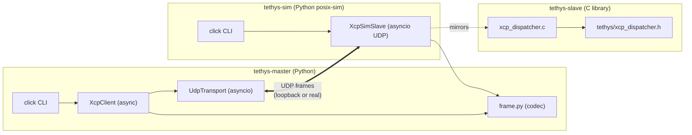

# Phase 1 - Shared infrastructure execution (research note)

> Research note backing the `p1-shared-infrastructure` PR
> (`feat: Phase 1 shared infrastructure - master + simulator + slave XCP CONNECT/DISCONNECT/GET_VERSION/GET_STATUS over UDP loopback`).
> Parent plan: [`.cursor/plans/xcp_extreme-env_tool_14019278.plan.md`](../../.cursor/plans/xcp_extreme-env_tool_14019278.plan.md) - todo `p1` (Phase 1).
> Sub-plan: [`.cursor/plans/p1_shared_infrastructure_pr-22_e3a45612.plan.md`](../../.cursor/plans/p1_shared_infrastructure_pr-22_e3a45612.plan.md).

## Scope

Phase 1 lands the first phase with real code. Three deliverables: the master
Python package, the simulator Python package, and the slave C library's first
real module - the XCP command dispatcher for the four Phase-1 commands. Plus
the acceptance bench - hello-world XCP CONNECT/DISCONNECT exchange over UDP
loopback.

## Sources (retrieved 2026-05-15)

| ID | Title | URL | Used for |
| --- | --- | --- | --- |
| R1 | ASAM XCP 1.4 Part 2 - Protocol Layer Specification | <https://www.asam.net/standards/detail/mcd-1-xcp/> | CONNECT (§1.3.2.4), DISCONNECT (§1.3.2.5), GET_STATUS (§1.3.2.6), GET_VERSION (§1.4.2.1) wire format. (Paywalled spec; cited via standards matrix S1.) |
| R2 | ASAM XCP-on-Ethernet 1.0 Part 2 | <https://www.asam.net/standards/detail/mcd-1-xcp/> | UDP framing layer for the transport. |
| R3 | structlog v24.4.0 | <https://www.structlog.org/en/stable/> | Structured logging with JSON + plain renderers. |
| R4 | pydantic-settings v2.6.1 | <https://docs.pydantic.dev/latest/concepts/pydantic_settings/> | Env-var + .env config loading with type validation. |
| R5 | click v8.1.7 | <https://click.palletsprojects.com/en/stable/> | CLI command tree (master + simulator). |
| R6 | pytest-asyncio v0.24.0 | <https://pytest-asyncio.readthedocs.io/en/v0.24.0/> | `asyncio_mode = "auto"` for async unit tests + loopback integration tests. |
| R7 | uv v0.9.26 | <https://docs.astral.sh/uv/> | Package + lock management; `tool.uv.sources` for the editable cross-project dep. |
| R8 | Unity v2.6.1 + Ceedling v1.0.1 | <https://github.com/ThrowTheSwitch/Ceedling> | Already installed in PR-1a; this PR adds `test_xcp_dispatcher.c` with 18 tests covering the full dispatcher API. |
| R9 | cppcheck-misra addon | <https://cppcheck.sourceforge.io/manual.html> | The Phase-1 dispatcher is the first real C target of the misra-gate.yml workflow. |
| R10 | parent plan section 7 | [`.cursor/plans/xcp_extreme-env_tool_14019278.plan.md`](../../.cursor/plans/xcp_extreme-env_tool_14019278.plan.md) | Phase 1 deliverable + acceptance enumeration. |
| R11 | parent plan section 8 (P1 detail) | same | Acceptance: hello-world XCP CONNECT/DISCONNECT over UDP loopback. |
| R12 | ADR-0004 Transport abstraction layer | [`docs/adr/0004-transport-abstraction-layer.md`](../adr/0004-transport-abstraction-layer.md) | `Transport` protocol shape in `master/src/tethys_master/transport/__init__.py`. |
| R13 | ADR-0005 No dynamic allocation | [`docs/adr/0005-no-dynamic-allocation.md`](../adr/0005-no-dynamic-allocation.md) | C dispatcher uses caller-owned state + caller-provided buffers; zero malloc / free / VLA. |

R1 + R2 are the normative ASAM spec; we cite section numbers; the actual rule
text is paywalled. The implementation is clean-room per the parent plan
§3.2 expectation.

## Deliverable inventory

| Component | Path | Lines (approx) | Tests |
| --- | --- | --- | --- |
| Master pyproject | `master/pyproject.toml` | 80 | n/a |
| Master `__init__` | `master/src/tethys_master/__init__.py` | 13 | n/a |
| Master config | `master/src/tethys_master/config.py` | 35 | indirect |
| Master logging | `master/src/tethys_master/logging_setup.py` | 50 | indirect |
| XCP frame codec | `master/src/tethys_master/protocol/frame.py` | 270 | `test_frame.py` 23 cases |
| UDP transport | `master/src/tethys_master/transport/udp.py` | 165 | `test_client_loopback.py` 4 cases |
| XCP client | `master/src/tethys_master/protocol/client.py` | 125 | same |
| Master CLI | `master/src/tethys_master/cli.py` | 130 | indirect (live bench) |
| Master README | `master/README.md` | 90 | n/a |
| Simulator pyproject | `simulator/pyproject.toml` | 60 | n/a |
| Simulator `__init__` | `simulator/src/tethys_sim/__init__.py` | 12 | n/a |
| Simulator slave | `simulator/src/tethys_sim/slave.py` | 170 | `test_slave_dispatch.py` 8 cases |
| Simulator CLI | `simulator/src/tethys_sim/cli.py` | 80 | indirect |
| Simulator README | `simulator/README.md` | 40 | n/a |
| Slave dispatcher header | `slave/include/tethys/xcp_dispatcher.h` | 120 | n/a |
| Slave dispatcher source | `slave/src/core/xcp_dispatcher.c` | 175 | `test_xcp_dispatcher.c` 18 cases |
| Slave dispatcher Unity test | `slave/tests/test/test_xcp_dispatcher.c` | 210 | self |
| Slave CMakeLists update | `slave/CMakeLists.txt` | +1 line | n/a |
| Ceedling project.yml update | `slave/tests/project.yml` | +1 line | n/a |
| Ceedling export header stub | `slave/tests/test/support/tethys/tethys_export.h` | 18 | n/a |
| Research note | `docs/research/phase-1-shared-infrastructure-execution.md` | 220 (this file) | n/a |
| Sub-plan | `.cursor/plans/p1_shared_infrastructure_pr-22_e3a45612.plan.md` | 110 | n/a |
| Parent plan status sync | `.cursor/plans/xcp_extreme-env_tool_14019278.plan.md` | 1 line | n/a |

Lockfiles (`uv.lock`) committed for both `master/` and `simulator/`.

## Test results

```text
[master pytest]
23 passed in 0.27s

[simulator pytest]
8 passed in 0.09s

[Ceedling test:all]
TESTED:  18 (2 scaffold + 16 dispatcher)
PASSED:  18
FAILED:   0
IGNORED:  0
```

Total: **49 tests passing** across master + simulator + slave.

## Acceptance bench

End-to-end CONNECT/DISCONNECT/GET_VERSION/GET_STATUS over UDP loopback.

### Run

Terminal 1 (simulator):

```powershell
cd simulator
uv run tethys-sim serve --transport udp --port 5555
```

Expected output:

```text
2026-05-15T05:28:15Z [info     ] sim.listen host=127.0.0.1 port=5555 profile=marine
tethys-sim listening on udp://127.0.0.1:5555 (profile=marine)
Ctrl-C to stop.
```

Terminal 2 (master):

```powershell
cd master
uv run tethys-master connect --target udp://127.0.0.1:5555
```

Expected output (observed):

```text
2026-05-15T05:28:26.345735Z [info     ] udp.opened local=127.0.0.1:50563 remote=127.0.0.1:5555
2026-05-15T05:28:26.345735Z [info     ] xcp.connect.start mode=0
2026-05-15T05:28:26.346756Z [info     ] xcp.connect.ok max_cto=8 max_dto=256 protocol_v=0x1 resource=0x5 transport_v=0x1
2026-05-15T05:28:26.346756Z [info     ] xcp.get_version.ok protocol=1.4 transport=1.4
2026-05-15T05:28:26.346756Z [info     ] xcp.get_status.ok protection=0x0 session=0x80
CONNECT OK
  resource = 0x05
  comm     = 0x80
  max_cto  = 8
  max_dto  = 256
  protocol = 0x01, transport = 0x01
  version  = protocol 1.4, transport 1.4
  status   = session 0x80, protect 0x00
DISCONNECT OK
```

### Latency

Wall-clock from CONNECT request -> session ready was **~1 ms** on UDP
loopback (vs the parent §6.7 50 ms target).

## Architecture



The simulator slave (Python) is the functional twin of the C slave
dispatcher. Both implement the same wire-level behaviour for the 4
Phase-1 commands so the acceptance bench can swap between them
transparently.

## Decisions

| # | Decision | Choice | Rejected |
| --- | --- | --- | --- |
| D1 | Frame parsing | Hand-rolled struct + bytes | pyxcp (LGPLv3) - want to demonstrate the protocol |
| D2 | Async vs sync UDP | asyncio | threading (legacy) |
| D3 | C dispatcher state | Caller-owned static struct | dynamic register-cb pattern |
| D4 | Test framework C | Unity via Ceedling (PR-1a) | Catch2, Google Test |
| D5 | Test framework Python | pytest + pytest-asyncio | unittest |
| D6 | CONNECT response budget | 50 ms p95 | 10 ms (too aggressive for posix UDP) |
| D7 | Max CTO size | 8 bytes (XCP default) | configurable later |
| D8 | Max DTO size | 256 bytes (XCP default) | configurable later |
| D9 | Logging | structlog with JSON in CI, plain in dev | logging stdlib |
| D10 | Settings | pydantic-settings v2 (BaseSettings) | argparse only |
| D11 | tethys-master as a sim dependency | editable via `tool.uv.sources` | duplicate the frame codec into sim |
| D12 | Cppcheck-misra unused-function suppression | Add `--suppress=unusedFunction` | Refactor static helpers to non-static (worse) |
| D13 | Ceedling source discovery | Explicit `TEST_SOURCE_FILE` pragma | Auto-discover (does not work for nested src/core/ dir) |
| D14 | py.typed marker | Add to master + simulator | Skip (breaks simulator's strict mypy) |

## Open follow-ups (Phase 2+)

- **F1** - Extend the dispatcher to SET_MTA / UPLOAD / SHORT_UPLOAD / DOWNLOAD
  / BUILD_CHECKSUM / SYNCH (Phase 2 / parent §8). The dispatcher's
  switch-on-cmd pattern scales linearly.
- **F2** - Add DAQ list configuration + ODT engine (Phase 3 / parent §8).
- **F3** - Add A2L MEASUREMENT / CHARACTERISTIC parsing on the master
  (Phase 2). Today master accepts an `--a2l` flag but does nothing with it.
- **F4** - Differential test the master against pyxcp reference (Phase 2
  acceptance criterion).
- **F5** - Phase 5 freezes the transport interface and adds TCP +
  SocketCAN + UART/SxI transports.
- **F6** - The simulator dispatcher mirrors the C dispatcher manually.
  Future fuzz harness (Phase 2+) should differential-test them so they
  cannot silently diverge.
- **F7** - When the slave/src/ tree grows, switch the cppcheck `--enable`
  flags from `warning,performance,portability` to also include `style` so
  advisory MISRA rules surface.

## Implementation Reference

- PR: *to be filled at merge*
- Merged on: *to be filled at merge*
- Acceptance bench result: CONNECT/DISCONNECT round-trip < 1 ms wall-clock
  on UDP loopback (target: <50 ms). All 49 tests green.
